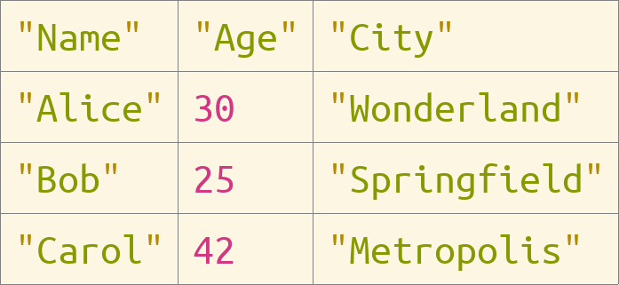

# ProjecturEd

> **Stop editing by hand. Describe the change — and the AI rewrites the live model in Julia.**

ProjecturEd is a projectional editor where your work is **structured data**, not
text — and a **built-in AI conversation** can read and rewrite *every part of
it*: the document *and* the projection that renders it. It does this by
executing Julia against the live editor, so the most tedious, repetitive,
multi-step edits collapse into a single sentence. You ask; the AI turns the
request into code and runs it.

It is a Julia reimagining of [the original
ProjecturEd](https://github.com/projectured/projectured), rebuilt around three
ideas that reinforce each other:

- **Composable all the way down.** Documents are assembled from smaller
  documents — any field can hold a primitive, a reactive collection, or another
  domain entirely. Those documents are rendered through bidirectional,
  composable projections, so views compose as freely as the data does. Every
  edit maps back to a precise structural operation on the model — never a string
  diff.
- **A reflexive editor.** The editor exposes its own internals — modules, types,
  functions, the live document tree, even the AI chat itself — as data the AI
  can inspect and reshape. The editor reaches into itself on your behalf.
- **AI-native by construction.** Because the model is the truth and the AI acts
  on it through typed operations and Julia, its edits are always structurally
  valid. No hallucinated line numbers, no patches that fail to apply.

---

## Editing without the keyboard grind


Open the assistant, type what you want, press **Enter**. Claude reads the live
document structure, looks up the real types and functions involved, writes
Julia, and runs it against the editor — `editor.document` and
`editor.projection` are bound in scope, so nothing is off-limits. Prefer to do
it yourself? Press **Alt+Enter** to run a Julia fragment directly. Either way the
run lands in the conversation as a first-class, re-readable code execution.

The conversation is not a sidecar bolted onto the editor. It is a real
ProjecturEd domain ([Conversation.jl](program/src/document/Conversation.jl)) —
messages, streaming response blocks, and code executions are all structured
documents, projected and selectable like everything else. **The editor edits
its own AI session with the same machinery it uses to edit your data.** That is
the reflexivity: there is no special case for "the AI part."

Under the hood:

- The AI's core tool, `execute_julia_code`, evaluates arbitrary Julia in-process
  with `Projectured` preloaded and `editor` bound — its handler lives in
  [Mcp.jl](program/src/editor/Mcp.jl).
- Before writing code, the AI reads the editor's *own* guides, modules, classes,
  and functions, exposed as resources, so it works from real signatures rather
  than guesses (also in [Mcp.jl](program/src/editor/Mcp.jl)).
- Two front doors, one tool registry: the in-editor assistant and an **external
  MCP server** (`127.0.0.1:9876/mcp`) share the same tools
  ([ToolRegistry.jl](program/src/editor/ToolRegistry.jl)), so any MCP client can
  drive the editor too.
- Real Claude (default `claude-opus-4-7`) when `ANTHROPIC_API_KEY` is set; a
  deterministic offline backend otherwise — so the example runs with no key and
  no network.

> **Honest status.** The assistant and the MCP bridge work end-to-end today, but
> they are new and evolving. Selection and cursor movement are solid across
> every domain; full character-level *manual* editing is the next milestone (see
> the [Roadmap](guide/roadmap.md)). The AI path is precisely what lets you get
> real work done before that lands.

---

## How a keystroke round-trips

Most editors store your work as a flat sequence of characters. ProjecturEd
stores it as **structured data** — a tree, a graph, a typed AST — and presents
it through *bidirectional projections* that translate between domains. The
projection renders your data as something you can read and edit; the reverse
projection maps each edit back into precise structural operations on the
original data.

```
        ┌─────────────┐    printer    ┌──────────────┐    printer    ┌────────────┐
        │   Document  │ ───────────▶  │  Intermediate│ ───────────▶  │  Graphics  │
        │  (domain A) │  ◀─────────── │  (domain B)  │  ◀─────────── │  / Display │
        └─────────────┘     reader    └──────────────┘     reader    └────────────┘
```

A keystroke arrives at the display; the reader chain walks back through each
projection's IO map, and the corresponding domain operation is applied to the
original document. The document re-projects forward, and the screen updates
incrementally via a pull-based reactive cell system.

This is what makes *both* the human and the AI edits safe: there is no text to
corrupt, only operations on a model.

---

## Composable data, composable projections

Composition runs through both layers — and they meet in the middle.

**Documents compose.** A document is built by nesting primitives, reactive
collections (`CellVector`, `ListNode`), and other documents; any field can hold
another domain. A `Workbench` holds pages that hold panels; a `Book` holds
chapters that hold paragraphs, lists, and embedded pictures; a `Conversation`
holds messages that hold blocks that hold Julia and text documents. There is no
privileged root type — you assemble domains out of smaller domains.

**Projections compose.** The bidirectional projections are composable functions,
which has non-obvious payoffs:

- **Switch views, not files.** Edit a JSON object as a tree, then render the same
  data as a widget form, a table, or source — no second representation to keep
  in sync.
- **Computed views for free.** Insert a sorting, filtering, or focusing
  projection and you get a sorted / filtered / zoomed view *without touching the
  model*. Undo removes the projection, not your data.
- **Mixed-domain documents.** Where the two layers meet: a `NestingProjection`
  embeds one domain inside another, so one document can nest JSON inside XML
  inside styled prose — and every cursor position round-trips faithfully across
  the boundaries.
- **Backend-agnostic rendering.** The pipeline emits an abstract
  `GraphicsCanvas`; SDL2 renders it today, while a terminal, web, or IDE-plugin
  backend could render it tomorrow with the projection code unchanged.

See the [projection system](guide/projection-system.md) and [higher-order
projections](guide/higher-order-projections.md) guides for the mechanics.

---

## What works today

| Domain | What it demonstrates |
|---|---|
| **JSON** | Full object/array/primitive tree editing with cursor and selection |
| **XML** | Element/attribute tree, mixed with HTML-style namespaces |
| **Text** | Styled multi-span text with word wrapping and line numbering |
| **Syntax** | Generic S-expression intermediate; the glue between semantic domains and text |
| **Graphics** | SDL2 render primitives; foundation for everything you see |
| **Widget** | Labels, buttons, checkboxes, tabbed panes, scroll panes, split panes, toolbars |
| **Workbench** | Full IDE shell: navigator, console, descriptor, operator, evaluator, assistant |
| **Conversation** | The AI chat itself as a structured domain: messages, blocks, code executions |
| **Table** | 2-D spreadsheet-style grid rendered directly to graphics |
| **Book** | Structured prose: chapters, paragraphs, lists, embedded pictures |
| **Math** | Algebraic expression trees (variable, binary op, parenthesised, assignment) |
| **Julia** | Julia AST subset: identifier, integer, binary op, call, if, function, block |
| **FileSystem** | Directory/file tree |
| **Collection** | `CellVector` (reactive indexed vector) and `ListNode` (lazy doubly-linked list) |

All domains support **selection** and **cursor movement** end-to-end. The SDL
backend is the primary frontend, and the in-editor AI assistant plus the MCP
server are built in. Character-level manual editing is the next milestone (see
the [Roadmap](guide/roadmap.md)).

### Screenshots

| JSON editor | Widget forms | Table view |
|---|---|---|
|  |  |  |

| Syntax tree | Julia AST | Workbench |
|---|---|---|
|  |  |  |

---

## Quick start

**Prerequisites**

- Julia 1.10+
- SDL2 and SDL_ttf (for the SDL backend)
- *(Optional)* `ANTHROPIC_API_KEY` to talk to real Claude in the assistant;
  without it the assistant falls back to a deterministic offline backend.

```sh
git clone https://github.com/projectured/projectured-julia
cd projectured-julia
julia --project=.
```

```julia
julia> using Projectured, ProjecturedExample
julia> run_example()                  # opens the JSON example
julia> run_example("assistant")       # the built-in AI conversation
julia> run_example("widget")          # widget form example
julia> run_example("table")           # table view
julia> run_example("julia")           # Julia AST editor
julia> print_example("syntax")        # dump a projection's output to stdout
julia> write_image_example("json", "/tmp/snapshot.bmp")   # save to file
```

See the [debugging guide](guide/debugging.md) for the full REPL helper catalogue
and the [testing guide](guide/testing.md) for running the test suite.

---

## Vision

ProjecturEd is not just a better JSON editor — it is an architecture for
**universal structured editing**, with AI as a first-class operator:

- **Describe-it editing.** Complex transformations become a request, not a
  hundred keystrokes. The AI inspects the typed model, writes Julia, and applies
  it — the keyboard/mouse grind becomes optional.
- **A self-describing editor.** The editor hands the AI its own modules, types,
  functions, guides, and live document tree, so the AI extends and reshapes the
  editor from the inside.
- **Any domain in ~100 lines.** Define your document types, write a projection
  to the syntax domain, and you have a fully navigable, fully editable — and
  AI-operable — view of your data.
- **Multiple backends.** The projection pipeline is backend-agnostic. Terminal,
  web, and IDE-plugin backends all receive the same `GraphicsCanvas`; only the
  renderer changes.
- **Mixed-domain documents & live collaboration.** Composable projections and
  structural operations on a well-defined model are the natural substrate for
  embedding domains within domains and for OT/CRDT-based collaboration.

See [the vision guide](guide/vision.md) for the full picture and a "Compared
to…" positioning relative to MPS, Lamdu, Hazel, Tree-sitter, and text editors.

---

## Repository layout

| Path | Contents |
|---|---|
| [program/src/](program/src/) | Core `Projectured` package — API, documents, projections, references, editor, devices, backends |
| [example/src/](example/src/) | `ProjecturedExample` package — concrete examples and `run_example` / `print_example` / `write_image_example` helpers |
| [example/workspace/](example/workspace/) | On-disk fixtures used by examples |
| [test/src/](test/src/) | `ProjecturedTest` package — `test_all` and every per-layer helper |
| [guide/](guide/) | All architecture and topic guides — see [the guide index](guide/README.md) for the reading-order index |
| [executable/](executable/) | Build configuration for a standalone executable |
| [font/](font/), [image/](image/) | Bundled assets and screenshots |
| [plan/](plan/) | Design notes and work-in-progress plans |

## Guides

Three reading tracks — pick the one that matches your goal.

### New here? Start with

1. [Concepts](guide/concepts.md) — plain-English introduction: what projectional editing is, the five core ideas, and a step-by-step walkthrough of what happens when you press a key.
2. [Examples tour](guide/examples-tour.md) — guided tour of six examples, from simplest to most complex; what to try and what each one demonstrates.
3. [Getting started](guide/getting-started.md) — prerequisites, setup, and the REPL helpers.

### Building something? Read next

4. [Architecture](guide/architecture.md) — layer diagram, module inventory, and the projection pipeline.
5. [Reactive cells](guide/reactive-cells.md) — the `Cell` system that powers incrementality.
6. [Macros](guide/macros.md) — `@document`, `@projection`, `@iomap` macros.
7. [Projection system](guide/projection-system.md) — the four projection interface functions and the printer/reader pair.
8. [Tutorial: new domain](guide/tutorial-new-domain.md) — step-by-step: add a new domain from scratch.

### Going deeper

- [Higher-order projections](guide/higher-order-projections.md) — `Sequential`, `Recursive`, the dispatchers, `Nesting`, `Alternative`.
- [Generic projections](guide/generic-projections.md) — `Preserving`, `Invariably`, `Copying`, `Sorting`, `Reversing`, `Focusing`.
- [Operations](guide/operations.md) — what an operation is and how the reader chain produces them.
- [Editor](guide/editor.md) — the REPL loop, event handling, and rendering pipeline.
- [Reference guide](guide/editor/reference.md) — reference paths and the `@reference` / `@reference_case` DSL.
- [Selection guide](guide/editor/selection.md) — how selection propagates through nested documents.
- [Devices and backends](guide/devices-and-backends.md) — the `Backend`/`Device` split.
- [Design decisions](guide/design-decisions.md) — why pull-based reactivity, every-field-is-a-cell, shared selection, `ProjectionReference`.
- [Selection deep dive](guide/selection-deep-dive.md) — the full reference/selection mechanism with worked examples.

### Per-domain guides

[json](guide/document/json.md) · [xml](guide/document/xml.md) · [text](guide/document/text.md) · [syntax](guide/document/syntax.md) · [graphics](guide/document/graphics.md) · [widget](guide/document/widget.md) · [workbench](guide/document/workbench.md) · [collection](guide/document/collection.md)

### Working in the REPL

- [Debugging](guide/debugging.md) — `run_example`, `print_example`, `write_image_example`, driving the printer/reader by hand, forcing reactive cells.
- [Testing](guide/testing.md) — `test_all`, per-layer helpers, walker utilities.

## Roadmap

See [the roadmap](guide/roadmap.md) for near-, medium-, and long-term plans.
The three next priorities: character editing, mouse click-to-select, and undo/redo.

## Contributing

See [CONTRIBUTING.md](CONTRIBUTING.md) for repo conventions, the PR process,
code style, and how to add a new domain.

## Conventions

- All indexing is **1-based** (Julia convention).
- Projections must be **bidirectional**: every printer needs a matching reader.

## Project context for agents

If you are an AI assistant working in this repo, also read [CLAUDE.md](CLAUDE.md);
it points at the same guides with a framing tuned for non-trivial changes.

## Licence

Dual-licensed:

- [LICENCE-PD](LICENCE-PD) — free, public-domain-style dedication for
  non-commercial use of unmodified copies only.
- [LICENCE-COMMERCIAL](LICENCE-COMMERCIAL) — required for commercial use
  or for any modification or derivative work. Contact
  levente.meszaros@gmail.com.
