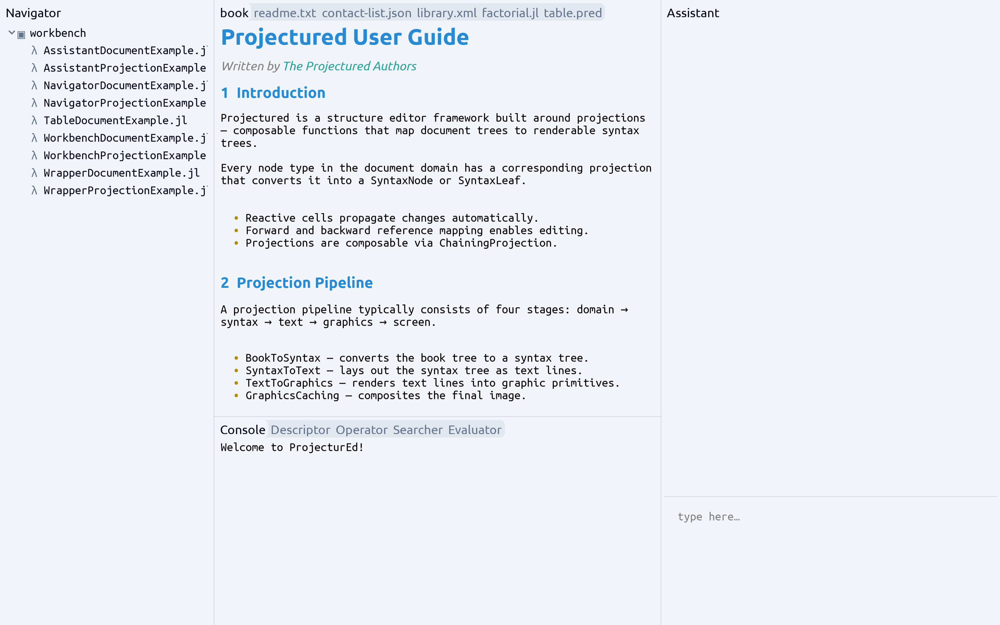
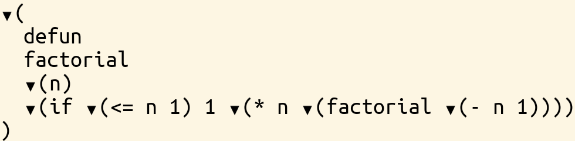
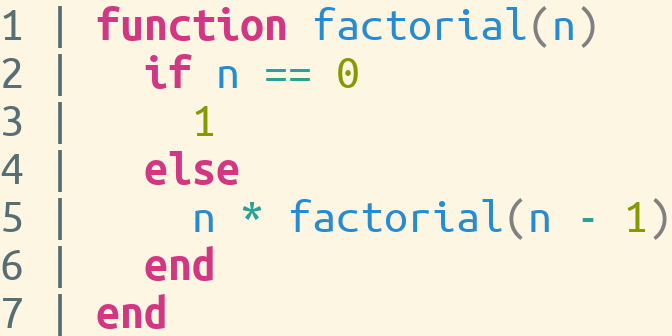

# ProjecturEd

ProjecturEd is a generic-purpose projectional editor, reimplemented in Julia
from [the original ProjecturEd](https://github.com/projectured/projectured).
Documents are structured data — trees, ASTs, graphs — presented through
bidirectional, composable projections: you edit the projection, and the edit is
mapped back to the underlying data.



## Vision

Three goals shape the design.

- **AI integration from the ground up.** A built-in AI conversation can read and
  modify both the document and the projection by executing Julia against the
  live editor. The intent is to move editing away from manual, keystroke- and
  mouse-driven state manipulation: you describe a change and it is applied as a
  structural operation. The conversation is itself a ProjecturEd document, so the
  editor edits its own AI session with the same machinery it uses for your data.
- **Expressiveness via composable documents and projections.** Documents are
  built by nesting primitives, reactive collections, and other documents — any
  field can hold another domain. Projections are composable functions over those
  documents, so one document can be shown several ways and a single view can mix
  domains. Both layers compose, which is what lets one mechanism cover JSON, XML,
  source code, prose, tables, and graphics.
- **Performance via lazy, incremental updates.** A pull-based reactive cell
  system recomputes only what a change affects, and projections are evaluated
  lazily, so the display updates incrementally as you edit. Because only the
  parts of a document that are actually viewed get forced, the same mechanism
  handles very large documents — and, with lazy structures like `ListNode` whose
  neighbours are re-projected on demand, even conceptually infinite ones: you can
  project a finite slice of an unbounded list and edit it without materialising
  the whole thing.

---

## AI-assisted editing

Open the assistant, type a request, and press **Enter**. Claude reads the live
document structure, looks up the types and functions involved, writes Julia, and
runs it against the editor — `editor.document` and `editor.projection` are both
bound in scope. To run code yourself, press **Alt+Enter** to evaluate a Julia
fragment directly. Either way the run is recorded in the conversation as a
re-readable code execution.

The conversation is a real ProjecturEd domain
([Conversation.jl](package/domain/main/conversation/Conversation.jl)): messages, streaming
response blocks, and code executions are all structured documents, projected and
selectable like everything else. The editor edits its own AI session with the
same machinery it uses to edit your data.

Under the hood:

- The AI's core tool, `execute_julia_code`, evaluates Julia in-process with
  `Projectured` preloaded and `editor` bound — its handler lives in
  [Mcp.jl](package/kernel/main/agent/Mcp.jl).
- Before writing code, the AI reads the editor's own guides, modules, classes,
  and functions, exposed as resources, so it works from real signatures
  ([Mcp.jl](package/kernel/main/agent/Mcp.jl)).
- The in-editor assistant and an external **MCP server** (`127.0.0.1:9876/mcp`)
  share one tool registry
  ([ToolRegistry.jl](package/kernel/main/agent/ToolRegistry.jl)), so an external MCP
  client can drive the editor too.
- The assistant uses Claude (default `claude-opus-4-7`) when `ANTHROPIC_API_KEY`
  is set, and a deterministic offline backend otherwise, so the example runs
  without a key or a network connection.

> **Status.** The assistant and the MCP bridge work end-to-end, but are new and
> still evolving. Selection and cursor movement work across every domain;
> character-level manual editing is the next milestone (see the
> [Roadmap](documentation/roadmap.md)).

---

## How a keystroke round-trips

Most editors store your work as a flat sequence of characters. ProjecturEd
stores it as **structured data** — a tree, a graph, a typed AST — and presents
it through *bidirectional projections* that translate between domains. The
projection renders your data as something you can read and edit; the reverse
projection maps each edit back into precise structural operations on the
original data.

```
        ┌─────────────┐    printer    ┌──────────────┐    printer    ┌────────────┐
        │   Document  │ ───────────▶  │  Intermediate│ ───────────▶  │  Graphics  │
        │  (domain A) │  ◀─────────── │  (domain B)  │  ◀─────────── │  / Display │
        └─────────────┘     reader    └──────────────┘     reader    └────────────┘
```

A keystroke arrives at the display; the reader chain walks back through each
projection's IO map, and the corresponding domain operation is applied to the
original document. The document re-projects forward, and the screen updates
incrementally via a pull-based reactive cell system.

This is what makes *both* the human and the AI edits safe: there is no text to
corrupt, only operations on a model.

---

## Composable data, composable projections

Composition runs through both layers — and they meet in the middle.

**Documents compose.** A document is built by nesting primitives, reactive
collections (`CellVector`, `ListNode`), and other documents; any field can hold
another domain. A `Workbench` holds pages that hold panels; a `Book` holds
chapters that hold paragraphs, lists, and embedded pictures; a `Conversation`
holds messages that hold blocks that hold Julia and text documents. There is no
privileged root type — you assemble domains out of smaller domains.

**Projections compose.** The bidirectional projections are composable functions,
which has non-obvious payoffs:

- **Switch views, not files.** Edit a JSON object as a tree, then render the same
  data as a widget form, a table, or source — no second representation to keep
  in sync.
- **Computed views for free.** Insert a sorting, filtering, or focusing
  projection and you get a sorted / filtered / zoomed view *without touching the
  model*. Undo removes the projection, not your data.
- **Mixed-domain documents.** Where the two layers meet: a `NestingProjection`
  embeds one domain inside another, so one document can nest JSON inside XML
  inside styled prose — and every cursor position round-trips faithfully across
  the boundaries.
- **Backend-agnostic rendering.** The pipeline emits an abstract
  `GraphicsCanvas`. SDL2 renders it in a native window and a web backend renders
  it in the browser (the editor runs in an HTTP/WebSocket server; the browser
  paints a JSON draw-list and sends back raw input) — the same projection code
  drives both. A backend can also tap an earlier stage: the `ConsoleBackend`
  renders the **Text** domain straight to the terminal (ANSI colors, keyboard
  navigation, no graphics step). An IDE-plugin backend could follow the same way.

See the [projection system](package/kernel/doc/projection-system.md) and [higher-order
projections](package/kernel/doc/higher-order-projections.md) guides for the mechanics.

---

## What works today

| Domain | What it demonstrates |
|---|---|
| **JSON** | Full object/array/primitive tree editing with cursor and selection |
| **XML** | Element/attribute tree, mixed with HTML-style namespaces |
| **Text** | Styled multi-span text with word wrapping and line numbering |
| **Syntax** | Generic S-expression intermediate; the glue between semantic domains and text |
| **Graphics** | SDL2 render primitives; foundation for everything you see |
| **Widget** | Labels, buttons, checkboxes, tabbed panes, scroll panes, split panes, toolbars |
| **Workbench** | Full IDE shell: navigator, console, descriptor, operator, evaluator, assistant |
| **Conversation** | The AI chat itself as a structured domain: messages, blocks, code executions |
| **Table** | 2-D spreadsheet-style grid rendered directly to graphics |
| **Book** | Structured prose: chapters, paragraphs, lists, embedded pictures |
| **Math** | Algebraic expression trees (variable, binary op, parenthesised, assignment) |
| **Julia** | Julia AST subset: identifier, integer, binary op, call, if, function, block |
| **FileSystem** | Directory/file tree |
| **Collection** | `CellVector` (reactive indexed vector) and `ListNode` (lazy doubly-linked list) |

All domains support **selection** and **cursor movement** end-to-end. The SDL
backend is the primary frontend; a [web backend](package/kernel/doc/devices-and-backends.md#web-backend)
renders the same editor in the browser (`run_web_example("json")`). The in-editor
AI assistant plus the MCP server are built in. Character-level manual editing is
the next milestone (see the [Roadmap](documentation/roadmap.md)).

### Screenshots

| JSON editor | Widget forms | Table view |
|---|---|---|
|  |  |  |

| Syntax tree | Julia AST | Workbench |
|---|---|---|
|  |  |  |

---

## Quick start

**Prerequisites**

- Julia 1.10+
- SDL2 and SDL_ttf (for the SDL backend)
- *(Optional)* `ANTHROPIC_API_KEY` to talk to real Claude in the assistant;
  without it the assistant falls back to a deterministic offline backend.

```sh
git clone https://github.com/projectured/projectured-julia
cd projectured-julia
julia --project=.
```

```julia
julia> using Projectured, ProjecturedExample
julia> run_example()                  # opens the JSON example
julia> run_example("assistant")       # the built-in AI conversation
julia> run_example("widget")          # widget form example
julia> run_example("table")           # table view
julia> run_example("julia")           # Julia AST editor
julia> run_web_example("json")        # same editor in the browser → http://127.0.0.1:8080
julia> print_example("syntax")        # dump a projection's output to stdout
julia> write_example_image("json", "/tmp/snapshot.bmp")   # save to file
```

See the [debugging guide](documentation/debugging.md) for the full REPL helper catalogue
and the [testing guide](documentation/testing.md) for running the test suite.

---

## Repository layout

| Path | Contents |
|---|---|
| [package/](package/) | One folder per package triad: `main/` (the code), `test/`, and `example/` as three sibling packages — API, documents, projections, references, editor, devices, backends |
| [package/projectured/example/](package/projectured/example/) | `ProjecturedExample` package — concrete examples and `run_example` / `print_example` / `write_example_image` helpers |
| [package/projectured/example/workspace/](package/projectured/example/workspace/) | On-disk fixtures used by examples |
| [package/projectured/test/](package/projectured/test/) | `ProjecturedTest` package — `test_all` and every per-package helper |
| [documentation/](documentation/) | All architecture and topic guides — see [the guide index](documentation/README.md) for the reading-order index |
| [package/executable/](package/executable/) | Build configuration for a standalone executable |
| [asset/font/](asset/font/), [asset/image/](asset/image/) | Bundled assets and screenshots |
| [plan/](plan/) | Design notes and work-in-progress plans |

## Guides

Three reading tracks — pick the one that matches your goal.

### New here? Start with

1. [Concepts](documentation/concepts.md) — plain-English introduction: what projectional editing is, the five core ideas, and a step-by-step walkthrough of what happens when you press a key.
2. [Examples tour](documentation/examples-tour.md) — guided tour of six examples, from simplest to most complex; what to try and what each one demonstrates.
3. [Getting started](documentation/getting-started.md) — prerequisites, setup, and the REPL helpers.

### Building something? Read next

4. [Architecture](documentation/architecture.md) — the package chain, layer/slice structure, module inventory, and the projection pipeline. [Terminology](documentation/terminology.md) defines the division vocabulary (package / layer / slice / module).
5. [Reactive cells](package/kernel/doc/cell.md) — the `Cell` system that powers incrementality.
6. [Macros](package/kernel/doc/macros.md) — `@document`, `@projection`, `@iomap` macros.
7. [Projection system](package/kernel/doc/projection-system.md) — the four projection interface functions and the printer/reader pair.
8. [Tutorial: new domain](documentation/tutorial-new-domain.md) — step-by-step: add a new domain from scratch.

### Going deeper

- [Higher-order projections](package/kernel/doc/higher-order-projections.md) — `Sequential`, `Recursive`, the dispatchers, `Nesting`, `Alternative`.
- [Generic projections](package/kernel/doc/generic-projections.md) — `Preserving`, `Invariably`, `Copying`, `Sorting`, `Reversing`, `Focusing`.
- [Operations](package/kernel/doc/operation.md) — what an operation is and how the reader chain produces them.
- [Editor](package/kernel/doc/editor.md) — the REPL loop, event handling, and rendering pipeline.
- [Reference guide](package/kernel/doc/reference.md) — reference paths and the `@reference` / `@reference_case` DSL.
- [Selection guide](package/kernel/doc/selection.md) — how selection propagates through nested documents.
- [Devices and backends](package/kernel/doc/devices-and-backends.md) — the `Backend`/`Device` split.
- [Design decisions](documentation/design-decisions.md) — why pull-based reactivity, every-field-is-a-cell, shared selection, `ProjectionReference`.
- [Selection deep dive](package/kernel/doc/selection.md) — the full reference/selection mechanism with worked examples.

### Per-domain guides

[json](package/domain/doc/json.md) · [xml](package/domain/doc/xml.md) · [text](package/visual/doc/text.md) · [syntax](package/visual/doc/syntax.md) · [graphics](package/visual/doc/graphics.md) · [widget](package/visual/doc/widget.md) · [workbench](package/domain/doc/workbench.md) · [collection](package/base/doc/collection.md)

### Working in the REPL

- [Debugging](documentation/debugging.md) — `run_example`, `print_example`, `write_example_image`, driving the printer/reader by hand, forcing reactive cells.
- [Testing](documentation/testing.md) — `test_all`, per-package helpers, walker utilities.

## Roadmap

See [the roadmap](documentation/roadmap.md) for near-, medium-, and long-term plans.
The three next priorities: character editing, mouse click-to-select, and undo/redo.

## Contributing

See [CONTRIBUTING.md](CONTRIBUTING.md) for repo conventions, the PR process,
code style, and how to add a new domain.

## Conventions

- All indexing is **1-based** (Julia convention).
- Projections must be **bidirectional**: every printer needs a matching reader.

## Project context for agents

If you are an AI assistant working in this repo, also read [CLAUDE.md](CLAUDE.md);
it points at the same guides with a framing tuned for non-trivial changes.

## Licence

Dual-licensed:

- [LICENCE-PD](LICENCE-PD) — free, public-domain-style dedication for
  non-commercial use of unmodified copies only.
- [LICENCE-COMMERCIAL](LICENCE-COMMERCIAL) — required for commercial use
  or for any modification or derivative work. Contact
  levente.meszaros@gmail.com.
