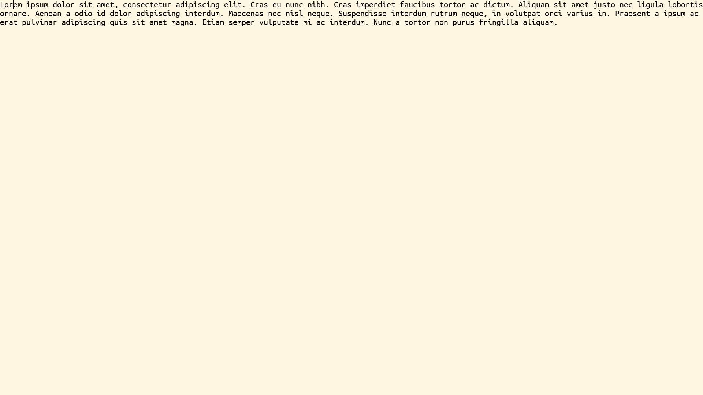

# Text Domain



The text domain bridges structural (syntax tree) and visual (graphics) domains. Text is stored as a flat sequence of spans, each with its own reactive style and color. Selection is a flat character offset.

**Indexing conventions**: paths use `[i]` for the i-th item (1-based) and `{k}` for the cursor at boundary `k` (0-based). The two are readings of the same axis — see [the boundary axis](../editor/reference.md#the-boundary-axis). In Text the axis appears as spans *and* as characters within a span; the same `[i]` / `{k}` syntax addresses both.

## Types

- **TextText**: Container holding a flat sequence of spans (`elements::CollectionDocument`); the top-level text document
- **TextString**: A text span with content and styling
- **TextNewline**: Line break with styling
- **TextSpacing**: Horizontal or vertical spacing
- **TextGraphics**: Embedded graphics within text

## Examples

```julia
# Create a simple text span (default font and color)
span = TextString("Hello")

# Create a span with explicit font and color
span = TextString("Hello", font_ubuntu_monospace_regular_24, color_default)

# Create a span with a computed content thunk
span = TextString(() -> uppercase(doc.name), font_ubuntu_monospace_regular_24, color_default)

# Create a newline
newline = TextNewline(font=font_ubuntu_monospace_regular_24)

# Create a container of spans
text = TextText(TextString("Hello"), TextString(" world"))

# Access and modify (transparent via @document macro — no [] needed)
span.content = "New content"
span.font_color = color_default
```

## Selection

Selection is a flat offset across all spans. At the top level, `[i]` selects the i-th span and `{k}` is the cursor between spans. When the path descends into a span, the sub-path indexes characters: `.content[i]` for the i-th character, `.content{k}` for the cursor between characters.

## Styling Fields

Each span has:
- `content::Cell` — the text string
- `font::Cell` — font style (e.g., "bold", "italic", "monospace")
- `font_color::Cell` — text color (name, hex, or rgb)
- `fill_color::Cell` — background fill color
- `line_color::Cell` — border/line color
- `padding::Cell` — inset/padding value

## Key Features

- Each span is independently styled
- Reactive styling updates propagate automatically
- Flat character offset selection for easy navigation

## Gesture mapping (`read_gesture`)

The geometry-free half of the Text reader lives on the document itself:
`read_gesture(::TextText, gesture)` ([document/Text.jl](../../package/domain/src/document/Text.jl))
maps an input gesture to an operation expressed against the `TextText`'s own
references (reading only `elements` and `selection`, never any pixel layout):

- `KeyPress(c)` → `ReplaceStringRangeOperation` (character insert)
- `Backspace` / `Delete` → `ReplaceStringRangeOperation`
- `Left` / `Right` → cross-span character cursor movement
- `Ctrl+Home` / `Ctrl+End` → jump to the first/last span character
- `Ctrl+.` → `ToggleCollapseOperation` (recognised here, resolved at the syntax layer)
- the decline rules (Alt+arrows, plain arrows while structural, Tab) return
  `nothing` so an outer (syntax) layer can own the gesture

`TextToGraphics` delegates to this and adds only the geometry-dependent arms
(visual up/down, plain Home/End, mouse click). Any backend that renders a
`TextText` directly — e.g. the `ConsoleBackend` — therefore gets character-level
editing without a graphics layout pass. See
[documentation/projection-system.md](../projection-system.md) for the full reader split.
