# Widget Domain

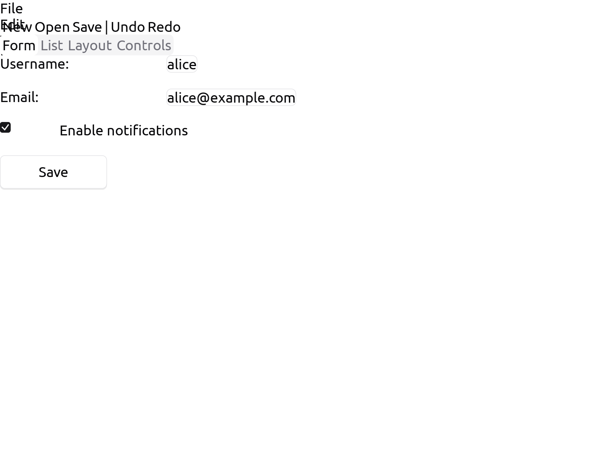

The widget domain is the UI layer that sits between domain-specific projections
and the graphics domain. Widgets describe what a user interface looks like —
labels, buttons, panes, scrollbars — in a backend-agnostic way. The
`WidgetToGraphics` projection (in
[projection/primitive/WidgetToGraphics.jl](../../package/domain/src/projection/primitive/WidgetToGraphics.jl))
turns a tree of widgets into a `GraphicsCanvas`.

The widget module is
[program/src/document/Widget.jl](../../package/domain/src/document/Widget.jl).

## The widget hierarchy

All widgets subtype the abstract `WidgetDocument` (which subtypes `Document`).

**Leaf widgets:**

| Widget | Purpose |
|---|---|
| `WidgetLabel(position, content)` | Static text label |
| `WidgetText(position, content)` | Editable text |
| `WidgetCheckbox(position, content)` | Boolean toggle (the `content` holds the checked state/label) |
| `WidgetButton(position, size, content; action)` | Clickable button — reacts to hover/press and invokes `action` on click |
| `WidgetTooltip(position, size, content)` | Tooltip popup |
| `WidgetMenuItem(content)` | Menu entry |

**Compound widgets:**

| Widget | Purpose |
|---|---|
| `WidgetComposite(position, elements)` | Generic container |
| `WidgetShell(children)` | Top-level window contents |
| `WidgetTitlePane(title, content)` | Pane with a title bar |
| `WidgetSplitPane(orientation, elements; sizes)` | Split with drag-resizable splitters (fields `elements`/`sizes`) |
| `WidgetTabbedPane(selector_element_pairs)` | Tab switcher |
| `WidgetScrollPane(content; position, size, scroll_position)` | Scrollable viewport (offset is `scroll_position`) |
| `WidgetScrollBar(orientation; value, thumb_size)` | Scrollbar control (fields `value`/`thumb_size`) |
| `WidgetToolbar(elements)` | Horizontal toolbar |
| `WidgetMenu(elements)` | Dropdown/menu |

**Extension widgets** (printer-only for now — their readers are no-ops). Colors,
radius and spacing come entirely from the theme (see below), so they carry only
the fields they need plus `visible`/`selection`:

| Widget | Purpose |
|---|---|
| `WidgetBadge(position, content; variant)` | Pill label (`:default`/`:secondary`/`:destructive`/`:outline`) |
| `WidgetSeparator(position; orientation, length)` | Hairline divider |
| `WidgetCard(position; title, description, content, footer)` | Bordered surface with header/body/footer |
| `WidgetSwitch(position, checked)` | On/off switch (track + knob) |
| `WidgetProgress(position, value)` | Progress bar (`value ∈ [0,1]`) |
| `WidgetSlider(position, value)` | Slider (track + knob) |
| `WidgetRadioGroup(position, options; selected)` | Vertical radio options |
| `WidgetAvatar(position, initials; size)` | Circular initials avatar |
| `WidgetAlert(position, title, description; variant)` | Callout (`:default`/`:destructive`) |
| `WidgetSkeleton(position; width, height)` | Loading placeholder |
| `WidgetToggle(position, content; pressed)` | Two-state toggle button |
| `WidgetToggleGroup(position, options; selected)` | Segmented control |
| `WidgetSelect(position, value; width)` | Closed select / combobox |
| `WidgetTextarea(position, content; width, rows)` | Multi-line text surface |
| `WidgetAccordion(position, items; expanded)` | Expandable sections |
| `WidgetTable(position, headers, rows)` | Data table with hairline rows |
| `WidgetTree(position, roots)` | Indented outline / tree view; nodes carry a `WidgetTreeNode(icon, label, children)` (icon + text), or a bare `String` / `(label, children)` for icon-less trees |

Each has a minimal isolated example — e.g. `run_example(widget_table_example)`,
`write_example_image(widget_tree_example, "tree.png")`.

## Gallery

Every widget has a minimal isolated example, rendered below.

### Core widgets

| | | |
|---|---|---|
| **Label**<br> | **Text (input)**<br>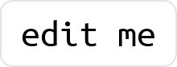 | **Checkbox**<br> |
| **Button**<br> | **Tooltip**<br>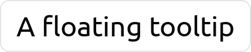 | **Menu item**<br>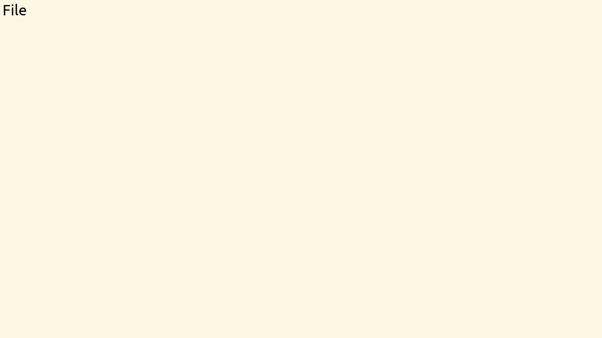 |
| **Menu**<br>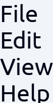 | **Toolbar**<br> | **Composite**<br>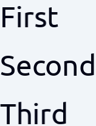 |
| **Title pane**<br>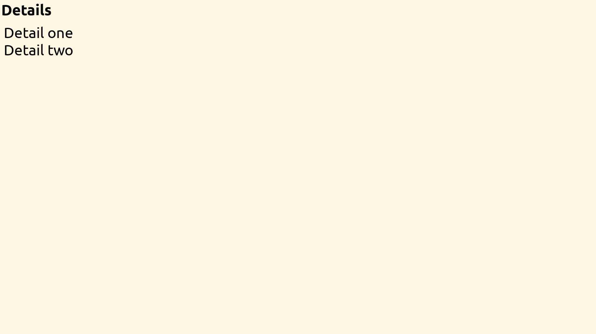 | **Split pane**<br>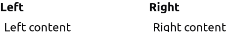 | **Scroll bar**<br> |
| **Scroll pane**<br>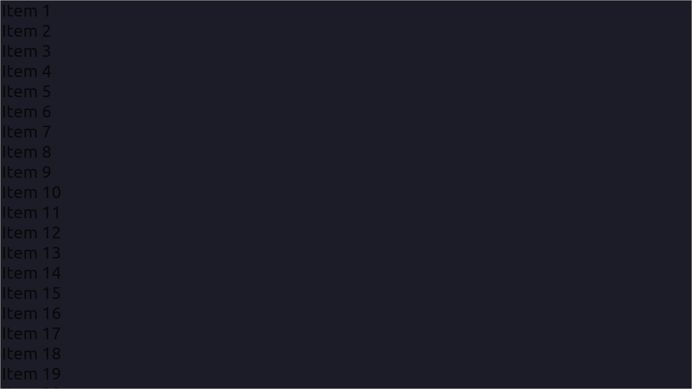 | **Shell**<br>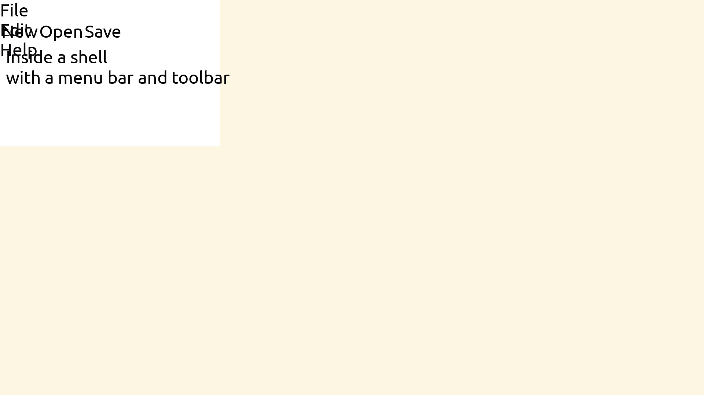 | **Tabbed pane**<br>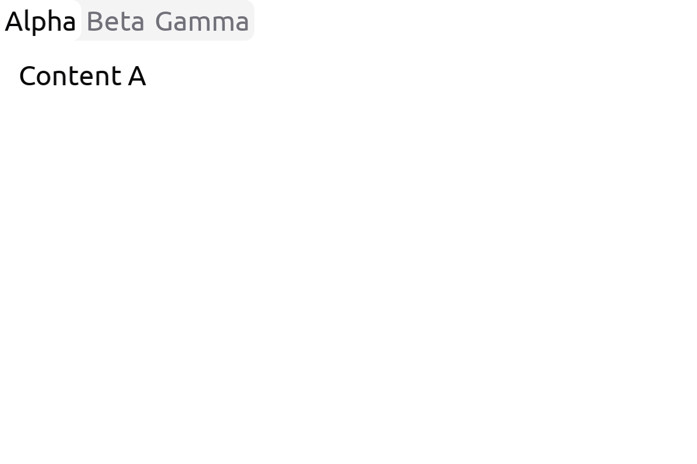 |

### Extension widgets

| | | |
|---|---|---|
| **Badge**<br>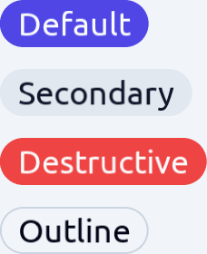 | **Separator**<br>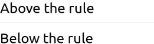 | **Card**<br>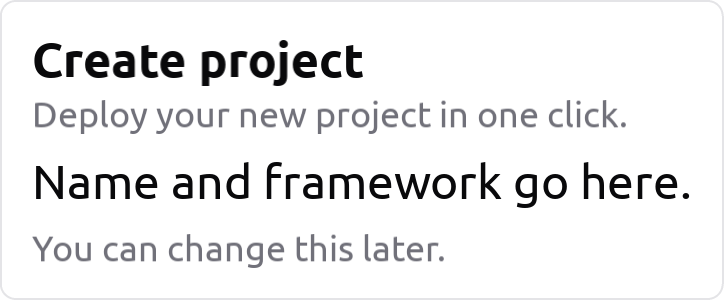 |
| **Switch**<br>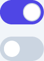 | **Progress**<br> | **Slider**<br>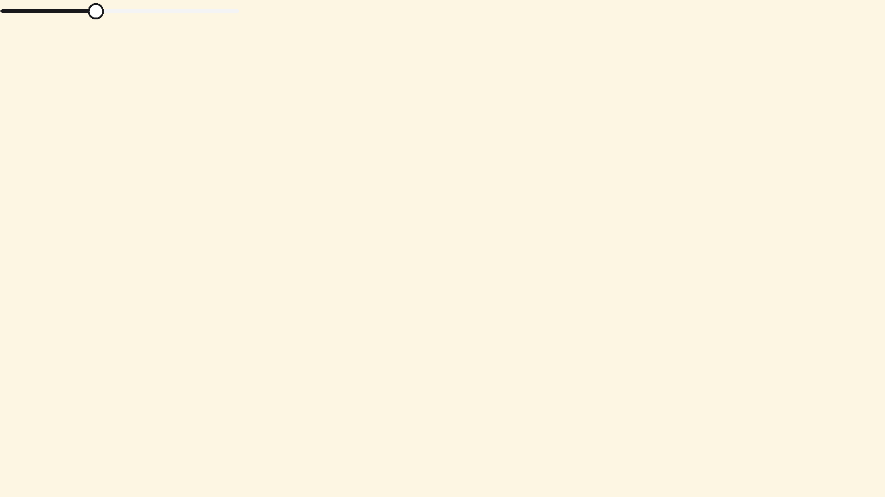 |
| **Radio group**<br>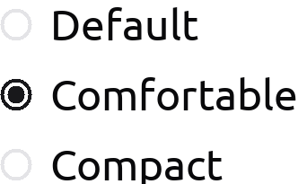 | **Avatar**<br> | **Alert**<br>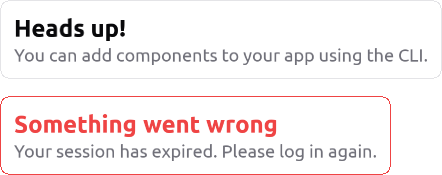 |
| **Skeleton**<br>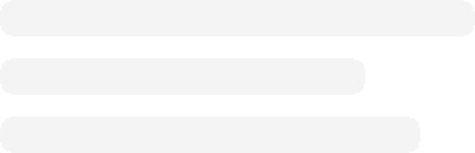 | **Toggle**<br>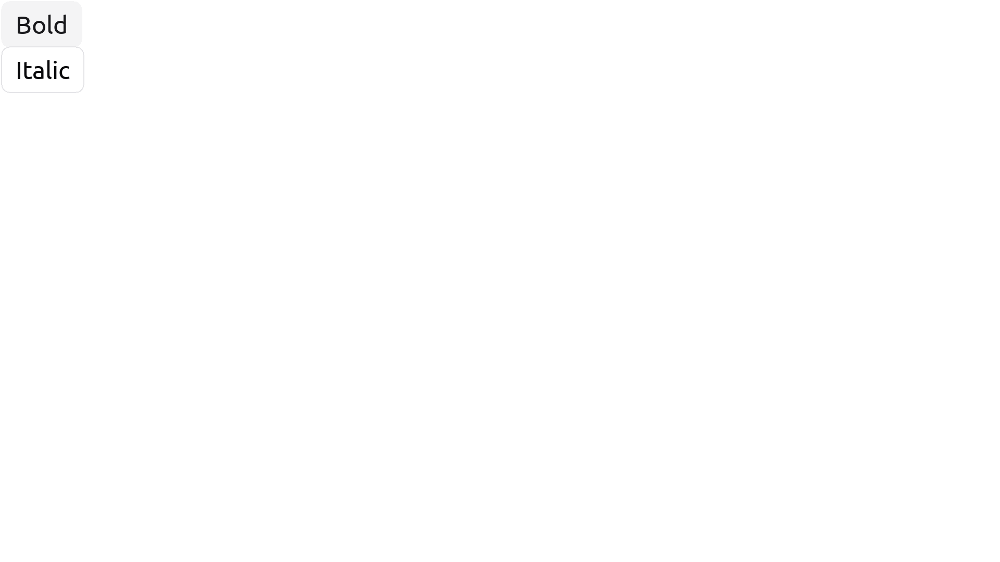 | **Toggle group**<br>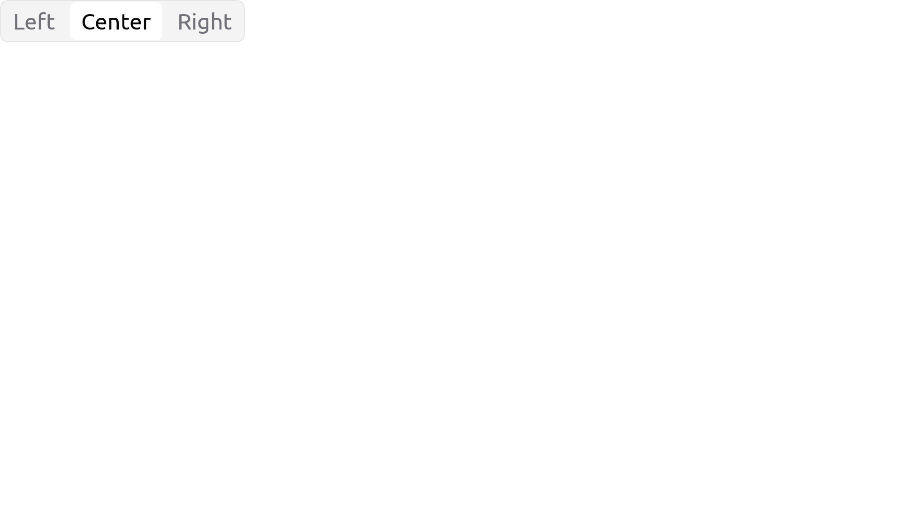 |
| **Select**<br>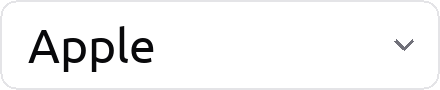 | **Textarea**<br>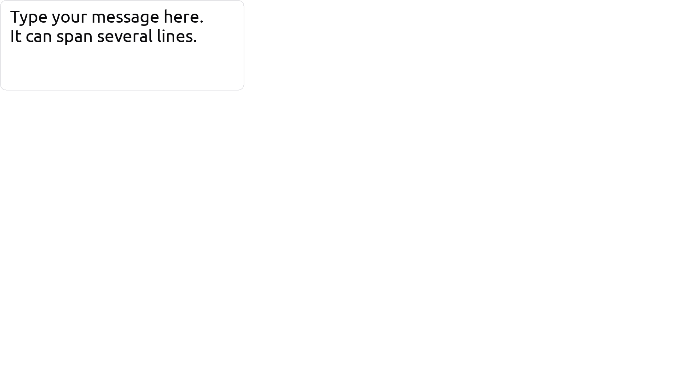 | **Accordion**<br>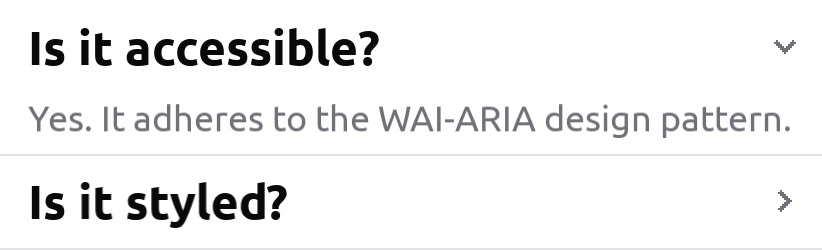 |
| **Table**<br>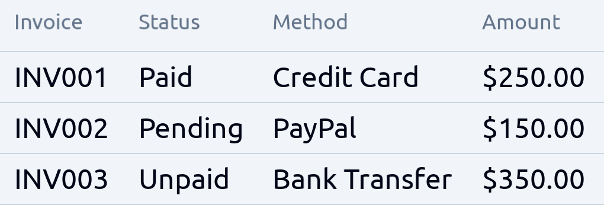 | **Tree**<br>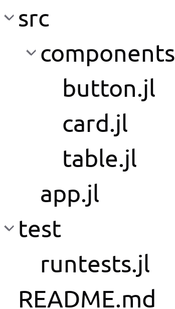 | |

## Theme

Widget look & feel is driven by a single `WidgetTheme` token object (a neutral
zinc palette: `background`, `foreground`, `card`, `muted`, `primary`,
`destructive`, `border`, `input`, `ring`, `radius`, …). It is the source of
truth — individual widgets should not carry their own colors. Two presets ship:
`widget_theme_light()` (the default) and `widget_theme_dark()`. Pass one to the
projection factory:

```julia
WidgetToGraphics(font; measure=sdl_measure_text, theme=widget_theme_dark())
```

The renderer leans on graphics primitives that anti-alias cleanly: `GraphicsRect`
(per-corner radius + optional `border_width`/`border_color`), `GraphicsLine`, and
`GraphicsCircle`. Offscreen `write_image` supersamples (2×) for smooth output.

## Shared visual fields

The original widgets carry seven base styling fields:

- `visible::Bool` — show/hide
- `margin::Inset`, `margin_color::StyleColor` — outer margin
- `border::Inset`, `border_color::StyleColor` — border
- `padding::Inset`, `padding_color::StyleColor` — inner padding

These map to nested CSS-style boxes. `Inset` (defined in
[document/Geometry.jl](../../package/domain/src/document/Geometry.jl)) holds four
sides; helpers `inset_size`, `inset_top_left`, etc. compute derived values.
The default value is `inset_default`.

## Widget operations

Defined alongside the widget types in
[document/Widget.jl](../../package/domain/src/document/Widget.jl):

| Operation | Effect |
|---|---|
| `HideWidgetOperation(w)` / `ShowWidgetOperation(w)` | toggle visibility |
| `ScrollWidgetOperation(scroll_pane, scroll_delta)` | adjust scroll offset (`scroll_delta::Point2D`) |
| `SelectTabOperation(tabbed_pane, index)` | activate a tab |
| `SetScrollBarValueOperation(bar, value)` | move the scroll-bar thumb |
| `StartSplitterDragOperation` / `ResizeSplitPaneOperation` / `EndSplitterDragOperation` | drag a split-pane splitter to resize the two adjacent slots |
| `InvokeWidgetActionOperation(widget)` | invoke a button's `action` callable (with the editor if it takes one) |
| `SetWidgetHoverOperation(widget, value)` / `SetWidgetPressedOperation(widget, value)` | set a button's transient `hovered` / `pressed` flag |

The `WidgetToGraphics` reader produces these in response to
`MousePress`/`MouseScroll`, routing each through the appropriate container
via hit-testing.

### Splitter drag-to-resize

A `WidgetSplitPane` splitter is draggable. The reader recognises a
`MouseDown(:left)` inside a splitter's gap (`thickness` plus a few pixels of
grab tolerance), then resizes the two adjacent slots on each `MouseMove` until
`MouseUp`. The drag is **stateful but the event pipeline is not**, so the
in-progress drag lives on transient cells of the pane itself:

- `active_splitter::Int` — `0`, or `k` while the splitter after slot `k` is held.
- `drag_anchor` — `nothing`, or `(coord, size_a, size_b)` recording the grab
  origin so every motion resizes *relative to the grab* (no accumulated rounding
  drift).
- `pinned::CellVector` — per-slot `Bool`; a slot dragged at least once is laid
  out at its `sizes` extent exactly.

Each move grows slot `k` and shrinks slot `k+1` by the same delta (total
conserved), clamped to each slot's `layout_min`/`layout_max`. In the
*unconstrained* regime `sizes[k]`/`sizes[k+1]` are written directly; in the
*constrained* regime (`allocate_axis`) the dragged slots are **pinned** — their
`sizes` value becomes a hard preference and their layout weight is zeroed, so
the drag sticks instead of being undone by weighted redistribution. `sizes` is
materialised from the measured slot extents on the first drag if it was empty.
These cells are transient UI state and are not meant to be serialised.

## Button behavior

`WidgetButton` is interactive. Its reader maps mouse events to operations, and
its printer renders from transient state — the same input → operation → input →
printer loop every other widget uses:

- **Click → action.** A `MousePress(:left)` on the button yields an
  `InvokeWidgetActionOperation(button)`. The editor evaluates it by calling the
  button's `action` callable — with the editor when the callable takes one
  argument (so it can mutate `editor.document` / projection state), otherwise
  with none. A `nothing` action is inert.
- **Hover / press feedback.** The button carries two transient cells,
  `hovered` and `pressed` (like the split pane's drag state — not serialised).
  `MouseDown` / `MouseUp` set `pressed`; a `MouseMove` over the button sets
  `hovered`. The printer reads both and picks the surface fill
  (`pressed → active_color`, else `hovered → hover_color`, else
  `background_color`) and drops the drop-shadow while pressed, so the button
  re-renders reactively as its state changes.

### Enter / leave: `WidgetHoverTrackingProjection`

Container hit-test routing delivers a `MouseMove` only to the child *under* the
pointer, so a button learns when the pointer enters it but never when it leaves.

The split of responsibility is deliberate: the **generic tracker decides *when*
the pointer crosses a boundary; each widget decides *what that means* for its
own state.** `WidgetHoverTrackingProjection`
([projection/higherorder/WidgetHoverTracking.jl](../../package/domain/src/projection/higherorder/WidgetHoverTracking.jl))
is transparent on print; on each `MouseMove` it:

1. routes a synthetic `MouseEnter` at the pointer into the inner pipeline — the
   widget under the pointer answers with an operation identifying itself (an
   opaque `widget` field; the tracker inspects nothing else);
2. if that target is unchanged, emits nothing;
3. if it changed, routes a synthetic `MouseLeave` to the previously-entered
   widget (at the last position over it) so *it* undoes its own state, and
   forwards both responses (bundled as a `CompoundOperation`).

So the tracker constructs **no** widget-specific operation — it only delivers
`MouseEnter` / `MouseLeave` and forwards whatever the widget returns. The
`WidgetButton` reader is what maps `MouseEnter` → `hovered = true` and
`MouseLeave` → clear `hovered`/`pressed`. A different widget can react to the
same crossings differently. `MouseEnter` / `MouseLeave` are first-class
(synthesised, not backend) pointer gestures in `MouseModule`; the tracker
mirrors `HoverProbeProjection` in shape.

To make this work, the container readers (`WidgetComposite`, …) route
`MouseEnter` / `MouseLeave` / `MouseDown` / `MouseUp` to the hit child, alongside
the `MousePress` / `MouseScroll` they already routed. (Wiring the remaining
containers — toolbar, shell, split pane — is follow-up; the composite covers the
current examples.)

## Image content

A leaf widget's `content` is polymorphic: besides a string (or, for some
widgets, a child `Document`), `WidgetLabel` and `WidgetButton` accept an
`ImageDocument` (`ImageFile` / `ImageMemory`). The printer detects it and emits a
`GraphicsImage` sized to the image's natural size, centered like a text label
(a muted placeholder rect until the image's `raw` cell is decoded). Decoding
stays in the backend (`decode_image_file!`); the domain-layer printer only
*reads* `content.raw`, the same seam inline text images use. See
`widget_button_image_example`.

## Projection to graphics

`WidgetToGraphics(font; measure=sdl_measure_text, theme=widget_theme_light())`
is the convenience factory that returns

```julia
RecursiveProjection(TypeDispatchingProjection(
    WidgetLabel       => WidgetLabelToGraphicsCanvas(...),
    WidgetText        => WidgetTextToGraphicsCanvas(...),
    WidgetCheckbox    => WidgetCheckboxToGraphicsCanvas(...),
    WidgetButton      => WidgetButtonToGraphicsCanvas(...),
    WidgetTooltip     => WidgetTooltipToGraphicsCanvas(...),
    WidgetMenu        => WidgetMenuToGraphicsCanvas(...),
    WidgetMenuItem    => WidgetMenuItemToGraphicsCanvas(...),
    WidgetComposite   => WidgetCompositeToGraphicsCanvas(...),
    WidgetShell       => WidgetShellToGraphicsCanvas(...),
    WidgetTitlePane   => WidgetTitlePaneToGraphicsCanvas(...),
    WidgetSplitPane   => WidgetSplitPaneToGraphicsCanvas(...),
    WidgetTabbedPane  => WidgetTabbedPaneToGraphicsCanvas(...),
    WidgetScrollPane  => WidgetScrollPaneToGraphicsCanvas(...),
    WidgetToolbar     => WidgetToolbarToGraphicsCanvas(...),
    WidgetScrollBar   => WidgetScrollBarToGraphicsCanvas(...),
    # …plus the 17 extension widgets, each with its own ToGraphicsCanvas:
    # WidgetBadge, WidgetSeparator, WidgetCard, WidgetSwitch, WidgetProgress,
    # WidgetSlider, WidgetRadioGroup, WidgetAvatar, WidgetAlert, WidgetSkeleton,
    # WidgetToggle, WidgetToggleGroup, WidgetSelect, WidgetTextarea,
    # WidgetAccordion, WidgetTable, WidgetTree.
))
```

The real factory maps all 33 widget types: the 15 core widgets above, the
`WidgetInsertion` type-replace placeholder, and the 17 extension widgets.

Each per-widget projection takes a `font`, a backend `measure` function,
and a `theme::WidgetTheme` (colours are read from the theme, not stored on
individual widgets). Containers project their children recursively via the
`recursion` argument and assemble the resulting canvases.

`WidgetScrollPaneToGraphicsViewport` is a separate composable projection
that emits a `GraphicsViewport` instead of a flat canvas — useful when the
downstream backend can clip to a viewport efficiently.

## Selection

Widgets carry a `selection::Reference` field like every other Document.
Selection paths typically descend into `content` for leaf widgets, into
`elements`/`selector_element_pairs` (collections) for containers, or to specific
fields like `scroll_position` of a scroll pane. The standard rules in
[the reference guide](../editor/reference.md) apply.

## When to use widgets vs. graphics

- Build user interfaces (workbenches, menus, dialogs, IDE layouts) at the
  widget level — the layer is meant for layout abstractions, not pixels.
- Custom drawing primitives (specialised visualisations, plot canvases)
  can go straight to `GraphicsCanvas`.
- A document being edited should generally not be a widget tree. Project
  through widgets only as a presentation layer; keep the source-of-truth
  document in its own semantic domain.

The Workbench domain (see [the workbench guide](workbench.md)) is the largest
example of a widget consumer in ProjecturEd.
