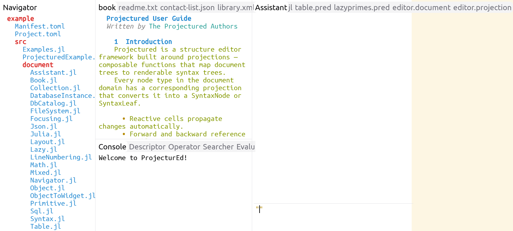

# Workbench Domain



The workbench domain models an IDE-style workspace. It is implemented in
[program/src/document/Workbench.jl](../../package/domain/src/document/Workbench.jl)
and rendered to widgets by
[projection/primitive/WorkbenchToWidget.jl](../../package/domain/src/projection/primitive/WorkbenchToWidget.jl).
A workbench is a high-level Document whose projection chain is

```
WorkbenchWorkbench ──WorkbenchToWidget──► WidgetShell ──WidgetToGraphics──► GraphicsCanvas
```

This is the largest demonstration in ProjecturEd of a multi-stage projection that
takes an application-level document all the way to pixels.

## Document types

All subtype `WorkbenchDocument` (`<: Document`).

| Type | Role |
|---|---|
| `WorkbenchWorkbench(navigation_page, editing_page, information_page, control_page)` | Top-level container; four pages |
| `WorkbenchPage(elements::CellVector)` | One column; holds a sequence of panels |
| `WorkbenchNavigator(workspace::Workspace)` | The "Navigator" panel — file/document tree |
| `WorkbenchConsole(content::TextText)` | The "Console" panel — text output |
| `WorkbenchDescriptor(content::ReferencePath)` | The "Descriptor" panel — describes the node referenced by `content` |
| `WorkbenchOperator()` | The "Operator" panel |
| `WorkbenchSearcher()` | The "Searcher" panel |
| `WorkbenchEvaluator(content)` | The "Evaluator" panel — eval-print loop window |
| `WorkbenchEditor(title, filename, content)` | An open document in the editing column |
| `WorkbenchAssistant(; conversation, input, model, system, api_key, status, llm)` | The "Assistant" panel — AI assistant window (keyword-only; field is `conversation`) |

Each panel carries a `title` (class-level constant or per-instance for
`WorkbenchEditor`) that becomes the title-bar text in the widget output.

## Projection

`WorkbenchToWidget()` is the entry-point factory. Internally it uses
`RecursiveProjection(TypeDispatchingProjection(...))` to dispatch on the
workbench type, with one projection per panel:

| Projection | Output |
|---|---|
| `WorkbenchWorkbenchToWidgetShell` | `WidgetShell` containing the four pages |
| `WorkbenchPageToWidgetTabbedPane` | `WidgetTabbedPane` over the page's panels |
| `WorkbenchNavigatorToWidgetScrollPane` | `WidgetScrollPane` with a tree of labels |
| `WorkbenchConsoleToWidgetScrollPane` | `WidgetScrollPane` over text content |
| `WorkbenchDescriptorToWidgetScrollPane` | `WidgetScrollPane` describing a node |
| `WorkbenchOperatorToWidgetScrollPane` | `WidgetScrollPane` operator UI |
| `WorkbenchSearcherToWidgetScrollPane` | `WidgetScrollPane` search UI |
| `WorkbenchEvaluatorToWidgetScrollPane` | `WidgetScrollPane` REPL UI |
| `WorkbenchEditorToWidgetScrollPane` | `WidgetScrollPane` containing the editor's projected content |
| `WorkbenchAssistantToWidgetSplitPane` | `WidgetSplitPane` containing the assistant's projected content |

Each of these is exported, so a custom workbench layout can re-bind one
projection without touching the rest.

## Building a workbench

```julia
wb = WorkbenchWorkbench(
    WorkbenchPage([WorkbenchNavigator(Workspace())]),
    WorkbenchPage([WorkbenchEditor(my_doc; title = "main.json")]),
    WorkbenchPage([WorkbenchConsole(),  WorkbenchEvaluator()]),
    WorkbenchPage([WorkbenchOperator()]),
)

proj = ChainingProjection(
    WorkbenchToWidget(),
    WidgetToGraphics(font),
)
```

The result is a tree whose root is a `WorkbenchWorkbench`, whose
projection emits a graphics canvas the SDL backend can render.

## Selection across the workbench

`selection::Reference` is present on every workbench type. Because
`WorkbenchEditor.content` holds an arbitrary inner document, the selection
path can descend straight through the workbench tree into the user's
file — e.g.

```
@reference editing_page.elements[1].content.entries[1].value.value{3}
```

means "in the active editor, character 3 of the value of the first JSON
object entry". This is the mechanism that lets a single global selection
mechanism address every cursor in the IDE.

**Keyboard focus follows this selection.** A raw key event (a printable
`KeyPress`, a `KeyDown`) is offered only to the panel the workbench selection
currently points at — so clicking into the JSON editor moves typing there rather
than leaving it in the assistant composer. The assistant composer manages its own
cursor and forward-projects no selection of its own, and its reader claims every
printable key; routing raw keys through the selected panel is what stops it from
swallowing keystrokes meant for another document. When nothing is selected the
composer keeps focus as the sensible default (so `ENTER` still submits a draft in
a freshly opened workbench). See the raw-event branch of
`WorkbenchWorkbenchToWidgetShell`'s `read_intent` in `WorkbenchToWidget.jl`.

## Where to look for the layout details

The columns, tab bars, scroll panes, and split pane geometry are all
expressed in `WorkbenchToWidget.jl` — the file is the canonical reference
for how a higher-level domain composes widget primitives. The widget tree
it builds then flows through `WidgetToGraphics` to produce the canvas.
