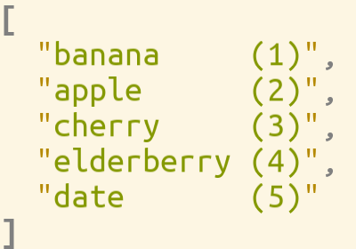

# Collections

> **Kind:** reference · **Status:** current · **Stands on:** [system-anatomy.md](../../design/system-anatomy.md)



The collection domain provides four generic, reactive container types used
everywhere in ProjecturEd. They are defined in
[source/collection/CollectionModule.jl](../../../source/collection/CollectionModule.jl)
and subtype `Document` so they participate in the selection mechanism. This guide
covers the two most common ones, `CellVector` and `ListNode`; `CellMatrix`
(2-D) and `CellTable` (rows of `CellVector`s) follow the same reactive-cell design.

```julia
const CollectionDocument = Union{CellVector, CellMatrix, CellTable, ListNode}
```

## Where Collection and Primitive sit

Collection is one of the two **shipped engine documents** that make up layer 1
of the `ProjecturedCollection` package — the concrete, domain-independent documents
every domain reuses:

- **Collection** — `CellVector` (reactive sequence container), `CellMatrix`,
  `CellTable`, `ListNode`. Provides the seam method
  `child_reference_steps(::CellVector) = [(RangeReferenceStep(i-1, i), node[i]) …]`
  registered on the kernel's `OperationModule`, so the pre-order document
  walk driving `SelectNextInsertionOperation` picks up `CellVector` elements
  without the kernel referencing the concrete type.
- **Primitive** — the editable domain-independent Bool/Number/String/Insertion
  documents with selection and identity, plus `ReplaceStringRangeOperation`
  / `ReplaceNumberRangeOperation` (the splice-range ops) with their
  `reroot_operation` methods.

A document type belongs in this base layer when it is shipped for reuse by
every domain and is domain-independent — Collection and Primitive pass; see
[architecture.md](../kernel/architecture.md) for the full membership rule. Two related
types that might look like they belong here do not: `ScreenDocument` lives in
`source/screen/` (window things are visual) and `WindowInput` lives in the
kernel's `EventModule` (it is a protocol type consumed by the editor loop,
not a document). The rationale for those placements is documented in
[devices-and-backends.md](../kernel/devices-and-backends.md).

## CellVector

```julia
@document struct CellVector
    elements::Vector = Cell[]
end
```

(`@document` injects the `selection::Reference` field automatically, appended
as the struct's last field — it is not written here.) `elements` defaults to
an empty `Cell[]`, so `CellVector()` comes from the macro's own generated
keyword constructor; there is no hand-written zero-arg constructor to
maintain. `CellTable`'s `rows::CellVector = CellVector()` and `CellMatrix`'s
`elements::Matrix{Cell} = Matrix{Cell}(undef, 0, 0)` follow the same pattern.

A growable indexed vector where **each slot is a reactive `Cell`**. A
write to one slot invalidates only the dependents that read *that* slot —
not the whole container — which is the key to scalable updates.

Construction:

```julia
CellVector()                       # empty — the macro's keyword constructor
CellVector(cells::Vector{Cell})    # adopt these cells
CellVector(items::AbstractVector)  # wrap each item in a Cell
CellVector(undef, n::Integer)      # n empty slots
CellVector(items...)               # wrap each positional arg in a Cell
ComputedCellVector(f)              # computed slots — thunk returns the element Vector
CellVector(Computed(f))            # the same thing spelled out
```

A single argument is always one *element*, whatever its type — `CellVector(f)` is a
one-element vector holding the function `f`. Deriving the element list is a different
request and says so, with `Computed`; the marker is the same one `ComputedCell` uses.

The computed form is what enables lazy children:

```julia
SyntaxNode("[", "]", ", ",
    ComputedCellVector(() -> [project_child(c) for c in input.children]))
```

The thunk is wrapped via `set_cell_function!` and re-runs whenever its reactive
dependencies invalidate.

### Access patterns

- `cv[i]` — returns the *value* stored at slot `i` (1-based).
- `get_cell_at(cv, i)` — returns the raw `Cell` at slot `i` (escape hatch).
- `cv[i] = val` — writes the value into the cell.
- `cv[i] = cell` (where `cell isa Cell`) — replaces the slot itself.
- `push!`, `pop!`, `insert!`, `deleteat!`, `sort`, `reverse` — standard
  vector operations, all updating the underlying `elements` cell.
- `length`, `firstindex`, `lastindex`, `iterate`, `eachindex`, `isempty` —
  standard.

### Reference semantics

The selection mechanism treats a `CellVector` as a sequence:

- `ElementReferenceStep(i)` (or `[i]` in the `@reference` DSL) → slot `i` (1-based).
- `PositionReferenceStep(i)` (or `{i}`) → cursor *between* slots (0-based).

## ListNode

```julia
@document struct ListNode
    value::Any
    prev::Union{ListNode, Nothing}
    next::Union{ListNode, Nothing}
end
```

A doubly-linked list where the node you hold is the **middle** — `prev`
and `next` are two tails growing outward in opposite directions. The
design is deliberately asymmetric in *use* but symmetric in *structure*:
both directions can be lazy.

- `head[1]` is the head itself
- `head[2]`, `head[3]`, … walk `next`
- `head[0]`, `head[-1]`, … walk `prev`

`push!(head, v)` appends to the right tail, `pushfirst!(head, v)`
prepends to the left tail. `get_left_tail(node)` and `get_right_tail(node)` walk
to the far end of the respective direction.

### Laziness

Because `prev` and `next` are `Cell` fields, they can be backed by
computations. `CopyingProjection` exploits this: when it projects a
`ListNode`, only the head is computed eagerly; the directions are
re-projected on demand. The result is that copying an *infinite* list is
still O(1) at construction time — extra nodes are materialised when
something reads them.

### Iteration

```julia
for n in head_node
    println(n.value)
end
```

Iteration starts from `get_left_tail(head_node)` and walks rightward through
`next`, yielding the whole reachable list. `Base.IteratorSize(ListNode) =
SizeUnknown()` because the right tail may be unbounded.

### `take_first` helpers

```julia
take_first(node, n)                 # n values walking :next
take_first(node, n, :prev)          # n values walking :prev
take_first(node, n_prev, n_next)    # window centred on node
```

Useful when projecting a slice of a potentially infinite list to a
finite-area widget.

## When to use which

- **CellVector** — for finite, bounded collections (JSON arrays, JSON
  object entries, syntax-tree children, file-system directory listings,
  widget children). The structure is finite and you have an index to
  address slots.
- **ListNode** — for sequences where the natural addressing is "the node
  in front of / behind this one" and where either direction may extend
  indefinitely. Used in the graphics module for lazy lines/elements and
  by `CopyingProjection`'s lazy traversal.

## Reactivity rules of thumb

1. **Reading one slot** registers a dependency on that slot only. A write
   to another slot does *not* invalidate readers of unaffected slots.
2. **Structural changes** (push/pop/insert/delete) update the outer
   `elements` cell, which invalidates anything that depends on the
   *shape* of the vector (e.g. layout code reading `length(cv)`), while
   leaving per-slot readers alone unless the slot they observe was
   actually moved.
3. **`ComputedCellVector(f)`** is the way to make a computed collection
   — recreate the whole thing reactively from upstream cells.
