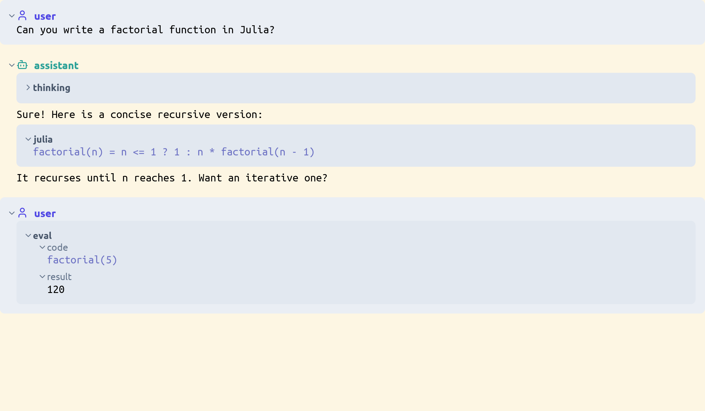

# Conversation domain

> **Kind:** design · **Status:** current · **Stands on:** [domain-anatomy.md](../../design/domain-anatomy.md), [widget.md](../widget/widget.md), [natural.md](../natural/natural.md)

`ProjecturedConversation` holds a chat with a model as documents: turns of parts, the evaluation of a piece of code with its result, and the draft of the next message. It draws the history as widgets, edits the draft part by part, and evaluates Julia in the running editor. This document says how the parts, the composer and the evaluator work together, and where the domain differs from the [shape of every domain](../../design/domain-anatomy.md).



## How it works

| Document | What it holds |
| --- | --- |
| `ConversationConversation` | `turns`, the history |
| `ConversationTurn` | `role`, which is `:user` or `:assistant`, then `parts`, `stop_reason` and `collapsed` |
| `ConversationPart` | `content`, a document of any domain, and `collapsed` |
| `ConversationThinking` | the reasoning of a model, with the `signature`, `redacted` and `data` that the provider needs back unchanged |
| `ConversationDraft` | `parts` of the message that a person composes, and `assistant`, the host of the draft or `nothing` |
| `EvaluatorForm` | `form` and `result`, two sections that fold on their own, and the metadata of the tool call that made them |
| `EvaluatorToplevel` | `elements`, a sequence of forms: a REPL in a tab |

Each list is a `CellVector`. A part that streams in is a `push!`: the computed cell of its turn prints the parts again, and the rest of the transcript stays as it is.

The domain differs from the shape of every domain. It has no `@domain` and no placeholder kit. It has no text form, no parser and no file type of its own. Its printers end in widgets, and not in a syntax tree.

### A part holds a document of another domain

A code part is a live document of its own domain, such as a `JuliaDocument` or a `JsonObject`. The package names none of those domains. It calls the natural-format seam of `ProjecturedNatural`: `get_natural_format` gives the format of a document, and `has_natural_parser` and `parse_natural_text` read a text into a document of that format. So the package has no dependency on the Julia, JSON or XML packages, and a domain that the session did not load has no parser there. `CODE_FORMATS`, which holds `:jl`, `:json` and `:xml`, selects the parts that get a panel.

### The transcript

`ConversationToWidget()` is a `TypeDispatchingProjection` of three projections. A conversation prints as a `VerticalLayout` of turns. A turn prints as a `WidgetCard` with a role header over a `VerticalLayout` of parts. A part prints as its content, or as a muted panel for code, a thinking block and an evaluation. [transcript.md](transcript.md) describes what each one draws, the folds, the object selection, the Alt+arrow walk and the paste rules.

The reference maps work one level at a time. Each level removes the steps that it printed and gives the rest to the IO map of the child that printed them: `turns[i]` is `children[i]`, and `parts[j]` is `content.children[j]`. A part is the lowest level, except for the `form` and the `result` of an evaluation. So a path of the widget layer never reaches the conversation document.

`_follow_selection!` makes the `selection` cell of each container a computed cell: the selection of the node, mapped forward, less the steps that lead to the container. The layout and the card draw their ring from that cell. So a selected message, part, form or result has a ring, and no printer runs again when the selection changes.

The transcript is read, not written. Its reader returns `nothing` for `ReplaceReferencedValueOperation`, `ReplaceStringRangeOperation` and `ReplaceNumberRangeOperation`, and passes every other operation on.

### The composer

`ConversationComposerToWidget` prints a draft as a `VerticalLayout` of one `WidgetCard` for each part, with no role header. The last part is the active part, and its content sets which keys the composer reads:

| Active content | Return | Other keys |
| --- | --- | --- |
| `PrimitiveString`, a line of text | submit the draft | Shift+Return: a new line. Tab or Insert: add a kind chooser. |
| `DocumentInsertion`, the kind chooser | make the named kind | Escape: back to a line of text. |
| the insertion of a Julia document | parse it into a `JuliaDocument` | Alt+Return: evaluate it into an `EvaluatorForm`. Shift+Return: a new line. Escape. |
| the insertion of another domain | parse it into a document of that domain | Shift+Return: a new line. Escape. |

After a code part or an evaluation, the composer appends a new line of text, so a draft always ends in one. The chooser reads its name with `resolve_insertion`, and `_composer_kind` keeps a type only when it is the insertion of a domain whose text has a parser. So `julia` makes a `JuliaInsertion`, and Return on a kind that the session can not parse does nothing.

The text keys belong to the text layer of the active part: typing, Backspace, Delete, the arrows and their Shift variants. Their edits come back through the reference maps of the composer as edits of `parts[n].content.value{s:e}`. The table of the composer holds only Return, Shift+Return, Alt+Return, Tab, Insert and Escape. It is a list of `GestureBinding`s, and `get_projection_gesture_bindings` returns the same list, so the gesture help shows the keys that the reader fires.

After each operation, `sync_draft_selection!` puts the complete selection of the editor on the caret of the active part, because a key goes where the complete selection points. [transcript.md](transcript.md#the-draft-has-one-selection) describes the one selection of the draft.

### The operations hold the document

A composer operation holds the draft, and not a path into it. `operation_travels_unchanged` is `true` for each of them, so no projection above changes or drops one. This is how a composer inside an assistant pane, or inside a page, reaches the editor.

The composer loads before any host, so it can not name the operation of a host. `make_submit_operation(host)` and `make_evaluate_operation(host)` are generic functions whose default returns `nothing`. `resolve_composer_host_operation(draft.assistant, operation)` replaces the submit and the evaluation of the composer with what the host returns. `ProjecturedAssistant` adds a method for `Assistant` by qualification, which is `PAR-QUALIFIED-EXTENSION`. A draft with no host keeps the operations of the composer: Return finalizes the draft, and Alt+Return keeps the form as a part.

### The evaluator

`EvaluatorForm` keeps `source`, the text of a call, and `input`, the whole input of a tool call, exactly as they arrived. The form is a projection of that text, and a projection is not reversible: a snippet that does not parse is a `PrimitiveString`, and a parsed one prints as the printer writes it. The assistant replays `source` and `input` to the model, not the printed form.

`ComposerEvaluateOperation` and `EvaluateSelectedFormOperation` both call `execute_julia_code(editor.tools, editor, text)`. When the last value is a `Document`, from `get_last_evaluated_value`, the result is that document, so a plot or a table draws live in the transcript. Otherwise the result is the printed output as a `TextBlock`. The code runs in the scratch module of the tool set of the editor, so a name that one form binds is defined in the next.

An `EvaluatorToplevel` opens in a tab when a person types `repl` or `evaluator`, or presses the Evaluator button of the toolbar. It starts with one empty form. Return evaluates the form that holds the caret, appends a new empty form, and moves the complete selection from the root to the new form, so the form that was evaluated shows no caret. Shift+Return puts a line break at the caret. `EvaluateSelectedFormOperation` holds the toplevel and not a path, so it also travels up the chain unchanged. `EvaluatorFormToVerticalLayout` draws a form as a `>` row that holds the code and a `=` row that holds the result. The two prompts stand in a column of their own, so the code and the result start at one x. A form shows no `=` row until it has a result. The reference maps pass the rest of a `form` or `result` path through, because a bare form is edited and not only read. The transcript of the assistant does not use this layout: it draws a form as two sections.

`is_selection_walk_stop(::EvaluatorForm)` is `false`, so the Alt+arrow walk passes from a part directly to its form or its result.

## How it fits

`ProjecturedConversation` depends on `ProjecturedCollection`, `ProjecturedDomain`, `ProjecturedFocus`, `ProjecturedNatural`, `ProjecturedLayout`, `ProjecturedPrimitive`, `ProjecturedProjection`, `ProjecturedStyle`, `ProjecturedText`, `ProjecturedWidget` and the kernel. It calls `execute_julia_code` of the `tool` layer of the kernel to evaluate a form.

`ProjecturedAssistant` holds a `ConversationConversation` and a `ConversationDraft`, and adds the two host methods; see [assistant.md](../assistant/assistant.md). `ProjecturedShell` puts an Evaluator button on the toolbar; see [shell.md](../shell/shell.md).

The package registers two natural rows under `:evaluator`, one for `EvaluatorToplevel` and one for `EvaluatorForm`. Each chains its widget projection to `VerticalLayoutToGraphicsCanvas`, because a tab reads its content through `print_child` and needs graphics. It also registers the insertion aliases `repl` and `evaluator`. It registers no row for `ConversationConversation` or `ConversationDraft`: a host adds those two. `conversation_widget_entry` and `conversation_draft_entry` in `ProjecturedConversationExample` are the rows that the examples and the application use.

## Design decisions

- **A turn is a list of parts, and a part draws as its content.** Only code, a thinking block and an evaluation get a panel, because the content of every other part shows what it is. The rejected alternative was a card with a kind heading around every part: `text` over the words "hi there" repeats what a person sees. See `plan/done/conversation-redesign.md` and `plan/pending/conversation-flat-transcript.md`, stages 1 to 3.
- **The fold state is on the domain node.** A turn builds its part cards again when a part streams in, so a flag on a widget would reset while the model writes. See `plan/done/transcript-folds.md`.
- **The composer grows by a typed insertion.** One `DocumentInsertion` chooser serves every domain that has a parser, instead of one code path for each domain. See `plan/done/conversation-redesign.md`, stage 3.
- **A form keeps its source and its input as they arrived.** A replay from the printed form sends a snippet that does not parse as `PrimitiveString("…")`, and a model copies that constructor into its next call. The tool headers of `plan/done/transcript-folds.md`, stage D, read the `input` field.
- **A host gives the meaning of Return by a method.** A mutable hook holds one answer for the whole process, and a `Ref` that one package writes during the precompilation of another is lost when the image loads. The reason is in the docstrings of `make_evaluate_operation` and of the two methods in `source/assistant/AssistantTurn.jl`.
- **The ring follows the selection through a cell.** Each container computes its own selection from the node, so no widget needs a `:selected` variant. Stage 6 of `plan/pending/conversation-flat-transcript.md` proposes that variant, and it is not built. `plan/pending/select-a-widget-and-paste-it-into-a-tab.md` holds the step that built the ring.

## Usage

```julia
conversation = ConversationConversation([
    ConversationTurn(:user, [ConversationPart("Can you write a factorial function?")]),
    ConversationTurn(:assistant, [
        make_conversation_thinking_part("A recursive one is the clearest."),
        ConversationPart(parse_julia("factorial(n) = n <= 1 ? 1 : n * factorial(n - 1)")),
        ConversationPart(EvaluatorForm(parse_julia("factorial(5)");
                                       source = "factorial(5)",
                                       result = make_evaluator_result_text("120"))),
    ]),
])
projection = make_conversation_widget_projection_example()   # the transcript
draft      = make_conversation_draft()                       # one empty line of text
composer   = make_conversation_editor_projection_example()   # the composer
```

The paths of a transcript name its objects, and the path of a draft names a place in the text of the active part:

```julia
@reference turns[2]                          # a message
@reference turns[2].parts[3]                 # a part of it
@reference turns[3].parts[1].content.result  # the result of an evaluation
@reference parts[1].content.value{4}         # the caret in the draft
```

- Examples: `conversation_widget_example` and `conversation_editor_example`, and the atomic examples `conversation`, `turn`, `part` and `draft`. The factories are in `example/conversation/`.
- Tests: `test_conversation()` runs the layering guard, `test_conversation_editor()` and `test_conversation_transcript()`. In `test/projectured/editor/`, `test_evaluator_toplevel()` covers the evaluator in a tab, and `test_conversation_serialization()` and `test_parse_markdown_blocks()` cover what the assistant sends and receives.

## Limits

- A part under the pointer does not light up. The ring of a selected object works; the `hovered` cell on a card, from stage 6 of `plan/pending/conversation-flat-transcript.md`, does not exist.
- The draft has no frame, no focus ring, no `+` button and no hint line. Stage 4 of the same plan puts them on the pane that holds the draft, and they are not done.
- The chooser makes an insertion that takes the whole source as text. A structural key, such as `[` for a JSON array, does not start a document.
- The arguments of a tool call print one `key: value` line each. A nested value prints as its Julia `string`.
- The composer and the evaluator set `is_error` from the text of the output: an output that contains `ERROR` or `Error` marks the result as an error.
- A tab that holds a bare `ConversationConversation` shows its reflected fields unless the host adds the conversation rows.
- No test is marked `@test_broken`.
