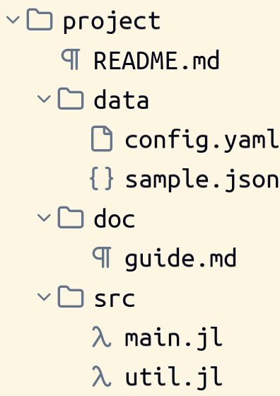

# File system domain

> **Kind:** design · **Status:** current · **Stands on:** [domain-anatomy.md](../../design/domain-anatomy.md), [fileformat.md](../fileformat/fileformat.md), [pane.md](../pane/pane.md)

The file system domain, `ProjecturedFileSystem`, shows folders and files of the disk as a tree, and it holds the workspace: the Explorer view that lists the folders you work in. It shows the names of files, not their contents. This document says how the tree is read, how a file opens, and where the domain differs from the [shape of every domain](../../design/domain-anatomy.md).



## How it works

| Type | What it is |
| --- | --- |
| `FileSystemFile` | a `pathname`, and no content |
| `FileSystemDirectory` | a `pathname` and its `elements` |
| `Workspace` | `folders`, the roots of the Explorer view |
| `WorkspaceFolder` | a `name` and a `pathname` |
| `FileSystemChooser` | a `directory` and a `name`: the document of an open or save dialog |

`make_filesystem_pathname(path)` reads a path from the disk into a `FileSystemFile` or a `FileSystemDirectory`, with all the entries below it. The tree is a snapshot. `WorkspaceToFileSystem` reads it again in a computed cell when the `pathname` of a folder changes. Nothing watches the disk.

There are two views of the tree:

- **`FileSystemToSyntax()`** prints a directory as a name leaf and an indented body. A custom `marker_eligible` predicate puts the fold marker on the directory name only, not also on the body. The name of a file is text that the projection introduces, so a text edit on it returns `nothing` and a caret on it selects the file.
- **`FileSystemToWidget()`** prints the whole tree as one `WidgetTree`, with an icon for each file extension. One pair of functions converts a path in the file system to a path in the tree and back. The printer and the reader both use it.

The Explorer chain is `WorkspaceToFileSystem`, then `FileSystemToWidget`, then `WidgetToGraphics`.

### Open a file

Enter on a row, or a double click, makes an `OpenFileOperation(path; wrap)`. The operation names the file and nothing else. When the editor applies it, `make_file_tab` reads the file into the document type that its extension registers, and `open_pane!` asks the pane tree where a file goes. The `wrap` function lets an application put every opened file in an overlay, for example an undo history.

### Choose a file

`FileSystemChooser` is the document of the open and save dialogs of `ProjecturedShell`. In the chooser, the open gesture of a row makes a `WriteChosenNameOperation` instead of an `OpenFileOperation`: Enter or a double click writes the name of the file into the `name` field. `get_chosen_path` joins the directory and the name. The shell turns the chosen path into an open or a save.

### Duplicate the Explorer

`has_document_duplicate` is `true` for every `WorkspaceDocument`, so the tab of the Explorer shows a `+` above its `x`. The duplicate is a copy of the folders; see [document.md](../kernel/document.md#the-duplicate). The selected row and the closed folders are not in the workspace. The reader writes the row selection on the computed `FileSystemDirectory`, and the closed folders are a cell of the `WidgetTree`. So a duplicate opens with no row selected and every folder open.

## How it fits

`ProjecturedFileSystem` depends on `ProjecturedFileFormat` and `ProjecturedPane` for the open, and on `ProjecturedWidget` for the tree. `ProjecturedShell` uses it for the dialogs and for the Explorer button of the toolbar.

Its `__init__` registers:

- `register_natural_syntax!(:filesystem, …)` with the syntax view;
- `register_natural_graphics!(:workspace, …)` with the Explorer chain for a `WorkspaceDocument`;
- `Workspace` and `WorkspaceFolder` as `.pred` types, so a saved window keeps its Explorer.

`FileSystemFile` and `FileSystemDirectory` are not `.pred` types, because the disk is their state. No parser exists. A `Workspace` also answers to the insertion names `explorer` and `file explorer`, and it starts with the current folder.

## Design decisions

- **An open names the file, not the place.** The file system package has no reference to tabs or panes. The pane tree chooses the place of a file.
- **A chooser only chooses.** The dialog document holds a path. The shell acts on it.
- **The tree is read, not watched.** A computed cell must not read the disk as a side effect of a print, so a live view of the disk needs a synchronizer outside the cells. [plan/tentative/filesystem-file-content-projection.md](../../../plan/tentative/filesystem-file-content-projection.md) discusses one.

## Usage

```julia
tree = make_filesystem_pathname("example/filesystem/fixture/project")
explorer = Workspace([WorkspaceFolder("project", abspath("example/filesystem/fixture/project"))])
run_example("navigator")                 # the Explorer view of the fixture project
```

- Examples: `filesystem_example` (syntax), `filesystem_widget_example` (the tree) and `navigator_example` (the workspace). They read the fixture under `example/filesystem/fixture/project/`, so they do not change when the repository changes.
- Test: `test_filesystem()` runs the layering guard and the two projection tests.

## Limits

- A workspace with more than one folder shows only the first folder. The comment in `source/filesystem/WorkspaceToFileSystem.jl` says so.
- A change on the disk does not show until something assigns the folder path again.
- A file has no content view in this domain. To edit a file, open it; its extension selects the domain.
