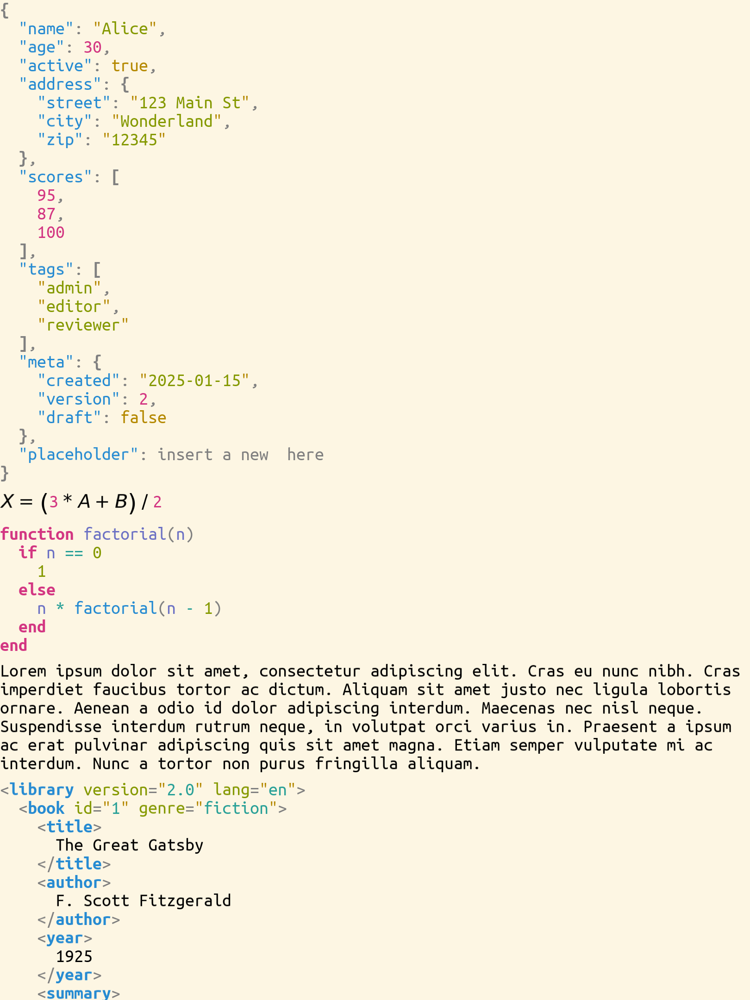

# The natural notation

> **Kind:** design · **Status:** current · **Stands on:** [concepts.md](../../design/concepts.md), [domain-anatomy.md](../../design/domain-anatomy.md), [projection-system.md](../kernel/projection-system.md)

`ProjecturedNatural` is the registry through which a domain says what its text looks like, which file extension it owns, and how a document of any domain reaches the screen with no projection written for the caller. It holds two tables: the rung table, which `print_natural_text` and `parse_natural_text` read, and the renderer table, which `NaturalToGraphics` reads. This document says what each table holds, how the second takes the rows of the first, and in which order the renderer tries its rows.



## How it works

### The ladder

A notation is a rung on one ladder:

```
domain ──▶ syntax ──▶ text ──▶ graphics
                        └────▶ string
```

A domain declares the rung that it reaches by itself, and the steps above it are composition. `:syntax` is the rung of a domain with a `*ToSyntax` projection. `:graphics` is the rung of a domain that draws itself, for example a page of blocks or a diagram. `:text` is the rung of prose; only `TextDocument` declares it, with the identity projection.

This package registers the steps `text → graphics` and `text → string` in its `__init__`. It must not depend on `ProjecturedSyntax`, because that package depends on this one. So `ProjecturedSyntax` registers `syntax → text` itself, with `register_natural_rung!`. A session that does not load `ProjecturedSyntax` has no text form and no graphics form for a document that has only a syntax rung.

### The rung table

A domain fills the rung table when its package loads. The JSON domain, in `source/json/JsonModule.jl`:

```julia
function __init__()
    register_natural_domain!(JsonDocument;
                             rung      = :syntax,
                             make      = () -> JsonToSyntax(),
                             format    = :json,
                             extension = ".json",
                             parse     = parse_json)

    register_file_document_type!(".json", JsonFile)
end
```

`register_natural_domain!` is three registrations in one call. The keywords come in pairs: `rung` with `make`, and `format` with `extension`. `parse` needs `format`.

| Part of the table | Key | Filled by | Read by |
| --- | --- | --- | --- |
| notations | a type | `register_natural_notation!(T, rung, make)` | `make_natural_projection`, `get_natural_entries` |
| formats | a type | `register_natural_format!(T, format, extension)` | `get_natural_format`, `get_natural_extension` |
| parsers | a format | `register_natural_parser!(format, parse)` | `parse_natural_text`, `has_natural_parser`, `find_natural_parser` |
| ladder | a pair of rungs | `register_natural_rung!(from, to, make)` | `make_natural_projection` |

The parser is keyed by the format and not by a type, so a package can register a grammar without the projection that prints it. YAML uses this to read `.yml` with `register_natural_parser!(:yml, parse_yaml)`. The `make` of a `:graphics` notation takes `(; measure)`, the text measure of the backend, and the `make` of another notation takes no argument. The `make` of a ladder step always takes `(; measure)`. A row that is registered twice keeps the first, so a reload adds no copy. A lookup of a notation or a format takes the most derived registered type that the document is a subtype of, whatever the order of the registrations: a row on an abstract root answers for every document under it, and a row on a subtype answers for that subtype.

`make_natural_projection(document, target)` builds the chain from the document up to `:syntax`, `:text`, `:graphics` or `:string`. It takes the highest rung that the document declares and for which the ladder has every step, and it considers `:graphics` only for a graphics target. The result is a `ChainingProjection` of `RecursiveProjection` stages, or `nothing` when no path exists. `print_natural_text(document)` is `make_natural_projection(document, :string)`, one print and a `String`.

### The renderer table

`NaturalToGraphics(; measure, font, wrap, extra)` returns a `RecursiveProjection` over one `TypeDispatchingProjection` that draws almost any document to a `GraphicsCanvas`. The first row whose type matches the document wins, and each child of a matched row enters the same dispatcher again. So a JSON value inside a page and a widget inside a diagram each draw in their own domain. The dispatcher adds no printer, reader or reference map of its own; see `plan/done/natural-projection.md`.

A list of ready-made rows and three keyed factory lists fill the table. The key of a factory is a `Symbol` that names the domain and makes a second call do nothing. A factory runs on each table build, so each renderer gets its own projection instances.

| List | Filled by | Read by |
| --- | --- | --- |
| ready-made syntax rows | `register_natural_syntax!(pairs...)` | `get_natural_syntax_entries()` |
| syntax factories | `register_natural_syntax!(key, () -> rows)` | `get_natural_syntax_entries()` |
| graphics factories | `register_natural_graphics!(key, (; measure) -> rows)` | `get_natural_graphics_entries(; measure)` |
| fallback factories | `register_natural_fallback!(key, (; measure, font, wrap) -> rows)` | `get_natural_fallback_entries(; …)` |

**The renderer table takes the rows of the rung table.** `get_natural_syntax_entries()` returns the ready-made rows, then the rows of the syntax factories, then every `:syntax` row of the rung table. `get_natural_graphics_entries` does the same with the `:graphics` rows. So one `register_natural_domain!` call is enough for a file, for text export and for a tab. The factory rows come first, so a factory row wins over a rung row of the same type. Markdown and RST use this: their syntax factory gives the rendered style to a tab, and their rung row gives the source form to a file. The form `register_natural_syntax!(pairs...)` adds ready-made rows, which come first, so a ready-made row wins over every other row of its type. A ready-made row serves the renderer only, and gives the type no notation in the rung table.

`NaturalToGraphics` puts the rows in this order:

1. `extra`, the rows of the caller, so an application can replace any row;
2. the layouts, then the widgets;
3. `get_natural_graphics_entries`: the domains that draw themselves;
4. the fallback rows for exact types;
5. `DocumentNothing` as the phrase "empty document", a `GraphicsDocument` as itself through `GraphicsToGraphics`, `TextDocument` as prose with optional word wrap, and a `CellVector` as a stack of blocks, one for each element;
6. the fallback rows for `Any`;
7. `Any` as the phrase "no natural rendering for T".

The syntax rows reach the renderer through the fallback. `ProjecturedSyntax` registers a fallback whose `Any` row is the syntax fabric: `make_natural_to_syntax_dispatch()`, then `SyntaxToText`, then `TextToGraphics`. That dispatch starts with `get_natural_syntax_entries()` and ends with the collection rows and the reflection table of `ObjectToSyntax`. So a `JsonObject` in a tab matches no row above step 6, goes into the fabric, and draws through `JsonToSyntax`. A value of no domain draws as its reflected fields; see [reflection.md](../reflection/reflection.md). Without `ProjecturedSyntax`, the same document draws as the phrase of step 7, and the renderer never raises an error.

A `ListNode` stays in the syntax fabric and does not become a stack of blocks, because a list can be lazy or infinite. A conversation or a pane is not drawn by this dispatcher: its own projection makes widgets, and a caller that needs one inside a content slot adds a row with `extra`.

## How it fits

`ProjecturedNatural` depends on `ProjecturedText`, `ProjecturedLayout`, `ProjecturedWidget`, `ProjecturedGraphics` and `ProjecturedDomain`, with the kernel packages. It does not depend on `ProjecturedSyntax` or on a domain. `ProjecturedFileFormat` depends on it.

| Registers | With |
| --- | --- |
| JSON, XML, YAML, Julia, SQL | `register_natural_domain!` at `:syntax` |
| Markdown, RST, math | `register_natural_domain!` at `:syntax`, a syntax factory and a graphics factory |
| book, the message log, the gesture log, the fault log | a syntax factory only |
| the file system | a syntax factory, and a graphics factory for the workspace |
| graph, formula, file format, inspector, assistant, evaluator | a graphics factory |
| `ProjecturedSyntax` | the fallback and the `syntax → text` step |

The file format package reads and writes files with `print_natural_text` and `parse_natural_text`; see [fileformat.md](../fileformat/fileformat.md). Each `XFile` type prints its content with `print_natural_text` in `emit_text`. The assistant checks `make_natural_projection(document, :string)` before it gives a document to the model as text. The application in `example/projectured/Application.jl` draws every tab through `NaturalToGraphics`, with rows in `extra` for the documents that have a designed view.

## Design decisions

- **The renderer table names no domain.** A table that named each domain would put the renderer above all of them. Each domain registers its own row in a file that it already has, so the renderer sits below every domain. See `plan/done/natural-projection.md`.
- **What is not loaded is not supported.** The syntax step and the reflection tail come from `ProjecturedSyntax`. A program that draws only a form and a table then does not carry the syntax domain.
- **Two tables serve two questions.** The rung table answers "this document, up to this target", where the rung of the document must win. The renderer table answers "any document, in any nesting, to pixels", where a caller or a domain can override a row.
- **A row is a factory when it holds state.** A factory gives each renderer its own projection instances, so two windows do not share reactive state.
- **The renderer degrades and never fails.** The last row draws a one-line message, so a tab with an unknown value still shows something.

## Usage

```julia
document = parse_natural_text(:json, "{\"name\": \"Alice\"}")
text     = print_natural_text(document)
has_natural_parser(:json)                  # true
get_natural_extension(document)            # ".json"
chain    = make_natural_projection(document, :string)
renderer = NaturalToGraphics(measure = measure_truetype_text)
```

- Example: `natural_example` draws a `CellVector` of a JSON, a math, a Julia, a text and an XML document with `NaturalToGraphics` alone.
- Tests: no `test/natural/` folder exists. `test_natural_renders_every_atom()` checks that every atomic example draws through `NaturalToGraphics`, and `test_natural_round_trips_every_atom()` checks that every atom with a format prints and parses back. Both are in `test/projectured/projection/CatalogCoverageTest.jl`. `test_natural_notation()` checks that the most derived registered type gives the notation and the format, and `test_natural_registry()` checks the order of the ready-made rows; both are in `test/projectured/projection/`. The two tests register types of their own, and they put the tables back as they found them when they end.

## Limits

- `NaturalToGraphics` takes the `:syntax` and `:graphics` rows of the rung table, but not the `:text` rows. `TextDocument` has a row of its own in the renderer, so no document loses its view today.
- A document that reaches the reflection tail shows its fields. It does not get the view of its domain.
