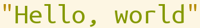

# Primitive

> **Kind:** design · **Status:** current · **Stands on:** [document.md](../kernel/document.md), [operation.md](../kernel/operation.md), [serialization.md](../serialization/serialization.md)

`ProjecturedPrimitive` holds the editable scalar documents, the `ObjectField` that makes one field of any object a document, and the two operations that edit a range of characters. A domain uses these where it needs a value that you edit and that has a selection of its own. This document says how a range edit finds its target, how it is undone, and why `ObjectField` has the form it has.



## How it works

| Document | Field |
| --- | --- |
| `PrimitiveBool` | `value::Bool` |
| `PrimitiveNumber` | `value`, a `Number` or `nothing` |
| `PrimitiveString` | `value`, a `String` or `nothing` |
| `PrimitiveInsertion` | `value`, what is typed so far, or `nothing` |
| `ObjectField` | `object`, the root, and `path`, a `Reference` into it |

Each is an `@document` struct, so the value is in a reactive cell and the document has a `selection`. `PrimitiveDocument` is the abstract root of the first four. A `PrimitiveString` indexes by character, not by byte: `length`, `getindex` and `setindex!` go through `collect` and `splice_string`, so a multibyte character is one position.

This package has no projection. `PrimitiveToSyntax` of [syntax.md](../syntax/syntax.md) prints a primitive as a leaf, and `PrimitiveToText` of [text.md](../text/text.md) prints it as one span. `CellTableToWidgetTable` makes a primitive of each cell of a table.

### The range edits

A typed key reaches the domain as one of two operations. Each holds a `reference` from the root of the editor document and a `replacement` string:

- `ReplaceStringRangeOperation` edits the characters of a string field.
- `ReplaceNumberRangeOperation` edits the text form of a number and parses the result again.

**The path ends in `.<field>[s:e]`, and the field can be on any document.** `_split_replace_reference` splits the path into the target, the field name and the range. `evaluate_operation` then calls `splice_value!` of the kernel with the current value of the field. The kind of that value selects the method: a string, `nothing`, a number, a `TextString` or a `TextBlock`. So one operation edits a `JsonString`, a syntax delimiter and a text span. The number operation does not use this dispatch. It always parses, so an empty field becomes a number when you type a digit. After the edit, the selection is a caret after the inserted text.

A path with no `.<field>[range]` at its end, for example a caret on a span that a projection added, splits to `nothing`. The operation then does nothing, and its inverse is `DoNothingOperation()`.

A projection reader maps a range edit back through the chain with no method of its own. Each operation has methods of `operation_reference`, `retarget_operation` and `reroot_operation`, and the default `read_intent` of the kernel uses these three. [operation.md](../kernel/operation.md) describes the rerooting.

`ReplaceRangeOperation` is the abstract type of a range edit with these two fields. `ReplaceStringRangeOperation` and `ReplaceTextRangeOperation` of the text package are its subtypes, so the transport methods are written once. `ReplaceNumberRangeOperation` is not a subtype, because its meaning does not depend on the value of the field.

### The undo of a range edit

**The inverse of a range edit is a write of the whole field, not another range edit.** `make_inverse_operation` reads the old value of the field and returns `ReplaceReferencedValueOperation(target, field, old_value)`. The operation holds the target object and not a path from the root, so the undo still works after the document moves in the tree. It also puts back any kind of value: a string, `nothing`, a number or a styled span.

### One field of one object

`ObjectField(object, path)` makes one value inside an object a document, so a projection can show one field of a struct that is not a document. `ObjectField(object, "name")` is the form for one field step. `get_object_field_value` reads the value with `evaluate_reference`, and a write is `ReplaceReferencedValueOperation(object, path, value)`.

`get_object_field_value` must be read inside a cell. A printer that reads it outside one keeps the value of the first print.

`ObjectField` has no label field. `ObjectFieldToWidget` shows a bare control and needs no label, and `ObjectFieldToSyntax` takes the name from the last field step of the path with `get_object_field_name`. A path that ends in an element step has no name, and `get_object_field_name` returns `nothing`.

## How it fits

`ProjecturedPrimitive` depends on the kernel and on `ProjecturedSerialization`. Text, syntax, widgets, the projection algebra, panes and many domains depend on it. `ObjectField` is in this package because it is the lowest package that both `ProjecturedWidget` and `ProjecturedSyntax` use, and each of them holds one projection of it.

Its `__init__` registers `PrimitiveString` as a `.pred` type, so a file can hold a bare string, such as the title of a tab. `make_pred_document(::Type{PrimitiveString}, …)` builds it from `PrimitiveString("hi")` or `PrimitiveString(value = "hi")`; the field has no default, so the macro gives no keyword constructor. `has_document_duplicate` is `true` for every primitive, so a duplicated pane copies the value and does not share it; see [document.md](../kernel/document.md).

## Design decisions

- **A scalar is a document.** A value then has its own selection and identity, and a domain does not write its own boolean or string leaf.
- **The edit dispatches on the value, not on the field name.** The field name is data. A new kind of text value needs one `splice_value!` method and no new operation.
- **The undo writes the whole field.** A range edit back would need a path that stays valid and a value of the same kind; the whole-field write needs neither. The reason is in `source/primitive/PrimitiveDocument.jl`.
- **The number edit stays outside `ReplaceRangeOperation`.** It parses the text in every case, so it does not share the dispatch of the string edit.
- **`ObjectField` has no label.** The two projections need different labels, so a stored label would be wrong for one of them.

## Usage

```julia
flag = PrimitiveBool(true)
limit = PrimitiveNumber(42)
name = PrimitiveString("hé!")
length(name)                  # 3 characters
name[1:2]                     # PrimitiveString("hé")

edit = ReplaceStringRangeOperation(@reference(value{3}), " there")   # insert at the end

field = ObjectField(server, "name")
path  = ObjectField(net, Reference(FieldReferenceStep("hosts"), ElementReferenceStep(2),
                                   FieldReferenceStep("address")))
get_object_field_value(field)
get_object_field_name(path)   # "address"
```

- Examples: the atomic catalog has `primitive/string`, `primitive/number` and `primitive/bool`, from `example/substrate/PrimitiveDocumentExample.jl`. `collection_example` shows a vector of `PrimitiveString`.
- Tests: `test_primitive()` in `test/substrate/document/PrimitiveDocumentTest.jl`, `test_primitive_to_text()` and `test_object_field_to_widget()` in `test/substrate/projection/`. A fault in a range edit often shows first in `test/substrate/editor/TypeinTest.jl` or in the reader test of a domain.

## Limits

- A number edit whose text does not parse sets the value to `nothing`. A letter typed into `42` clears the number.
- The docstring of `ReplaceStringRangeOperation` leaves the result undefined when the caret is on the boundary between two adjacent strings.
- No projection prints a `PrimitiveInsertion`, and no code outside this package makes one.
