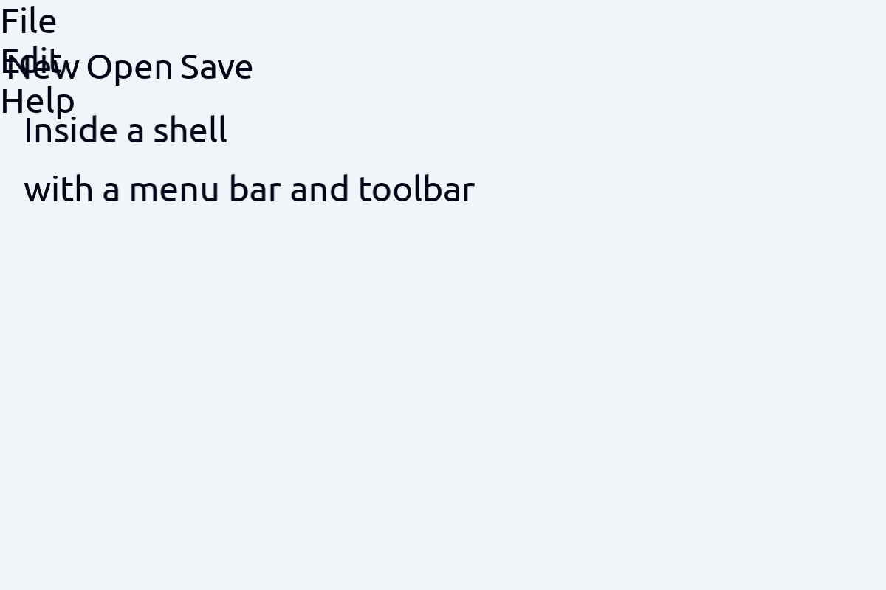

# Shell

> **Kind:** design · **Status:** current · **Stands on:** [widget.md](../widget/widget.md), [screen.md](../screen/screen.md), [pane.md](../pane/pane.md)

`ProjecturedShell` holds everything that a window has besides the document in it: the wrappers that a binary stacks over its window, and the chrome that the window is drawn in. One package holds both, so two binaries show one interface and can not drift into two lists. This document says why the wrappers have their order, how the chrome is a document, how the toolbar reaches the tools, and what does not work yet.



## How it works

### The fold

`make_window_wrap(; …)` returns the fold `(document, projection) -> (document, projection)`. A window entry applies it before the window opens, and a binary names by keyword what its window has:

| Keyword | What it adds |
| --- | --- |
| `gesture_help` | F1 opens a window that lists the gestures that work where the person is |
| `command_palette` | Ctrl+Shift+P finds a command by name and runs it |
| `selection` | Alt and an arrow walk the objects, and the clipboard acts on the selected one |
| `clipboard_gestures` | which of the six gestures of `CLIPBOARD_GESTURES` the window has |
| `history` | a `projection -> projection` wrapper for what the window remembers |
| `shell` | the chrome: `(document) -> (menu_bar, toolbar, status_bar, context_menu, size)` |
| `tooltip`, `pointer` and `tooltip_feed` | what the document under the pointer says about itself, once it rests |
| `context_menu` | the menu of the document under the pointer on a right press |

**The order is fixed.** From the inside out: the history, the shell, the hover tracker, the selection walk with the clipboard, the tooltip probe, the context menu probe, the help, the palette, and the recorder of the gesture log.

- The **history** is innermost because it is a recursive type dispatch over the tree. A wrapper between it and the tree prints that subtree itself, and the recursion never reaches the type that it dispatches on.
- The **shell** is outside the document of the window and inside everything that acts on a window. So the walk and the clipboard reach into the chrome, and a verb that reads the pane tree goes past it with `get_wrapped_document`.
- The **hover tracker** is around the shell, so it sees the whole window: only something that sees the bands and the panes can tell that the pointer left a toolbar button for a row in a pane. It takes no keyword, because a window that shows a button must light it.
- The **probes** are over the walk, because a probe reads the document that the walk selects in. They are under the help and the palette, because a probe must not answer for a window that one of those opened. **A probe passes every event on**: the tooltip probe only watches the pointer, and a tooltip opens when the pointer rests, at a deadline its `tooltip_feed` names in the loop. The host hands the same feed to `run_window_editor(feeds = …)`. [tooltip.md](../tooltip/tooltip.md) describes the rest.
- The **recorder** is outermost, where it sees every operation of the window. It takes no keyword and writes into the log of the session, and **View → Gesture log** opens that log in a tab. So the tab holds what happened before it opened, and a person can open it after a fault.

A wrapper that opens a window of its own needs `make_opened_window_projections()`, the value of the `opened_window_projections` keyword of `run_window_editor`. A host that turns the tooltip on passes the rows that draw its own documents as `content`, because a tooltip can hold a document of any domain.

### The popup route

`make_popup_screen_wrap()` is the value of the `screen_wrap` keyword of `run_window_editor`. It puts `WidgetPopupResolverProjection` on the window route, where the screen coordinates of a popup are known. It is not part of the fold, because the fold never sees the screen. Without it a `WidgetSelect` does not drop down, a submenu does not open, and a `WidgetContextMenu` takes the right press and shows nothing.

### The chrome is a document

`make_window_shell_document(document; menu_bar, toolbar, status_bar, context_menu, size)` puts the document of the window inside a `WidgetShell`, and `make_window_shell_projection(projection)` draws it. The bands draw through the dispatch of `WidgetToGraphics`, and the `content` slot goes to the projection that drew the window before, so the content draws as it did without the shell.

**The chrome is data.** A person can select, reference, walk, copy and save it, and a verb can reach it. A shell that only a printer made could be none of those. Wrapping is idempotent: a document that is already a `WidgetShell`, for example one read back from a file, keeps its identity and takes the bands that it is given.

**The shell fills its window.** The printer, `WidgetShellToGraphicsCanvas` in the widget package, takes the extent on each axis from the authored `size`, else from the available size that the parent gives. Only a shell with neither takes the size of its content. The window gives its own size as the available size, so the fold passes no `size`, and the shell follows the window when it resizes. The content gets the extent less the insets and the bands. A band gets the width and no height, so it is as tall as what it holds, and the status bar is on the bottom edge.

**What is saved is the window, and not the bands.** `WidgetShell` writes only its `content`. A menu bar belongs to the binary, and the fold makes the bands again at each start, so one binary never writes its menu into a file that another binary opens.

### How a host adds a command

Each band takes an `extra`, and `make_window_command(label, callback; icon, shortcut, tooltip)` makes one item:

```julia
_host_shell(document) =
    (make_window_menu_bar(; extra = Any[WidgetMenuItem("Run"; submenu = WidgetMenu(Any[
         make_window_command("Run all", _run_all!)]))]),
     make_window_toolbar(),
     make_window_status_bar(document), nothing, nothing)
```

So a host adds a command and needs no widget package of its own.

**An item goes on a band only when its callback does the work.** `WidgetShell` fires a menu shortcut before the focused widget gets the key. So an item with a shortcut that it can not perform takes the key away from the widget that could answer it. The callback calls the verb of the slice that owns the command, so the menu is a second way to one implementation. The gesture log records the `InvokeActionOperation` of the item, and not the pane operation that the callback applies.

**A status bar must be reactive.** `make_window_status_bar(document)` makes each segment a computed cell over the document of the window: the title of the focused tab and the selection. A band built from strings would show the state of the window when it opened, and never change.

### The toolbar opens the tools

`make_window_toolbar(; assistant, explorer, extra)` holds one `WidgetToolbarItem` for each tool of the window: the explorer, the assistant, the evaluator, the message log, the gesture log, the fault log, the frame statistics and the selection. Each shows an icon, and its tooltip starts with the name of the tool. A new tab is not on it, because the tab strip of every group has a button for that.

`make_window_tool_command(label, type; icon, tooltip, make)` makes one button. **A press reaches the tool, and makes one only when none exists.** It gives the focus to a tab that holds a `type`: the first one in the focused group, else the first one in the window. A tab counts when the document that it wraps is a `type`, so a tool inside a history counts too. When no tab holds one, it opens `make(editor)` in a new tab. `make` makes by default what `Ctrl+T` and the name of the tool make. View → Gesture log calls the same function.

Two tools need what only the window has. `assistant` makes the assistant of the window, with its backend and its greeting; when it is `nothing`, the toolbar has no assistant button. `explorer` makes the file explorer over the folder of the window; when it is `nothing`, the button opens the working directory.

**A button must not open a tool that stays empty.** The window fills three tools, and not the tab. A capture of the logger and a feed fill the message log, a feed fills the frame statistics, and the fault store of the editor fills the fault log. `run_with_window_tools` gives all three, and a binary opens its window through it:

```julia
run_with_window_tools() do feeds, start
    editor = make_editor(document, projection, "Title"; backend = backend, feeds = feeds)
    start(editor)
    run_editor!(editor)
end
```

The capture is removed when the window closes, also when it throws, so the logger that the window replaced comes back. [log.md](../log/log.md) and [statistics.md](../statistics/statistics.md) describe the two feeds.

**An Alt+click on a band selects in that band.** A band is not the `content` of the shell, so an Alt+press over the menu bar, the toolbar or the status bar names a field of that band. On the toolbar it names the button under the pointer, `toolbar.elements[i]`. The tooltip probe finds the document under the pointer with the same press, so a button shows its name as a tooltip.

### The pointer in a shell

The shell hands a press, a down, an up, a move, a scroll and a crossing to the band under the pointer, in that band's frame. **A drag keeps the band it started in**: the band that takes a `MouseDown` gets every move with a button held and the next `MouseUp`, wherever the pointer is. So a divider dragged across the status line keeps moving, and its release is not lost. A split pane reads a drag in progress before it checks its own bounds for the same reason.

A hover, a held button, a tab drag in flight and a divider drag are **view state**. The readers that write them mark the write with `ReplaceViewStateOperation`, and a history does not record it, so Ctrl+Z after a hover takes back the edit before it.

### The two probes

The document under the pointer gives its tooltip and its context menu. `compute_tooltip` and `compute_context_menu` are generic functions of `ProjecturedDomain`, and the fold gives them to the two probes; [tooltip.md](../tooltip/tooltip.md) describes the probe. Only `WidgetShell` carries a `context_menu` field, which holds the menu of the window itself. The context menu probe calls the function on the document under the pointer, and then on the root. So a right press on empty space also gets a menu. A tooltip is always a window of its own, which is the rule `PAR-MANY-WINDOWS`. `pointer` gives the pointer in screen coordinates, because only a backend has it.

### The file dialogs

`open_file_dialog!(editor, directory)` and `save_file_dialog!(editor, file, directory)` open a `WidgetDialog` over a `FileSystemChooser` as a window of its own. Both are built on `make_file_dialog`, because the chooser only chooses a path. The open command then applies `OpenFileOperation`, and the save command sets `file.filename` and applies `SaveFileOperation`. [filesystem.md](../filesystem/filesystem.md) describes the chooser.

## How it fits

`ProjecturedShell` depends on `ProjecturedClipboard`, `ProjecturedDomain`, `ProjecturedFileFormat`, `ProjecturedFileSystem`, `ProjecturedFocus`, `ProjecturedGestureHelp`, `ProjecturedGestureLog`, `ProjecturedPane`, `ProjecturedProjection`, `ProjecturedScreen`, `ProjecturedStyle`, `ProjecturedTooltip`, `ProjecturedWidget` and the kernel. Six more dependencies are there for the tools of the toolbar: `ProjecturedAssistant`, `ProjecturedConversation`, `ProjecturedFault`, `ProjecturedInspector`, `ProjecturedLog` and `ProjecturedStatistics`. None of them depends on the shell.

`example/projectured/Application.jl` builds its window with the fold, the chrome and `run_with_window_tools`, and a downstream window host uses the same toolbar. The package has no `__init__` and registers no row, file type or `.pred` type. A binary calls its functions.

## Design decisions

- **The order of the wrappers is fixed by what each one reads.** The reasons are in [the fold](#the-fold). See [plan/done/both-binaries-offer-one-interface.md](../../../plan/done/both-binaries-offer-one-interface.md).
- **The chrome is a document.** A shell inside a printer could not be selected, saved or reached by a verb. See [plan/done/both-binaries-offer-one-interface.md](../../../plan/done/both-binaries-offer-one-interface.md).
- **The shell takes the available size of its parent.** The rejected alternative was a shell that gives its content no available size when it has no authored `size`. That shell draws the panes only as wide as their content, and draws no status bar. See [plan/done/the-shell-fills-its-window.md](../../../plan/done/the-shell-fills-its-window.md), and [layout-rules.md](../../rule/layout-rules.md), which names the shell.
- **A press reaches a tool, and never opens a second one.** One rejected option was a press that always opens a new tab: three presses give three message logs with the same lines. The other was a second press that closes the tool, which loses the conversation of an assistant. See [plan/done/the-toolbar-opens-the-tools.md](../../../plan/done/the-toolbar-opens-the-tools.md).
- **The shell names the tools.** The rejected options were a button that each tool slice registers in its `__init__`, and a table in `Application.jl`. A slice can not have the setup of the window, such as the backend of the assistant or the folder of the explorer, and a second window host can not reach a table in the application. The cost is six more dependencies. See [plan/done/the-toolbar-opens-the-tools.md](../../../plan/done/the-toolbar-opens-the-tools.md).
- **The gesture log is always recorded.** The tab that shows it must hold what happened before it opened.

## Usage

```julia
wrap = make_window_wrap(; shell = document -> (make_window_menu_bar(),
                                               make_window_toolbar(; assistant = editor -> Assistant()),
                                               make_window_status_bar(document), nothing, nothing))
document, projection = wrap(document, projection)
run_with_window_tools() do feeds, start
    editor = make_editor(document, projection, "Title"; backend = SdlBackend(), feeds = feeds,
                         screen_wrap = make_popup_screen_wrap())
    start(editor)
    run_editor!(editor)
end
```

- Tests: `test_shell()` runs the layering guard, `test_shell_completeness()`, `test_window_wrap()`, `test_widget_tooltip()`, `test_julia_tooltip()`, `test_tooltip_probe()`, `test_tooltip_feed()`, `test_context_menu_probe()`, `test_window_shell()` and `test_file_dialog()`. `test_shell_completeness()` fails when a `test_*` function under `test/shell/` is not called by `test_shell()` exactly once. The layout of the shell and how it hands the pointer to its bands are in the substrate suite, `test_widget_shell_layout()` and `test_widget_shell_pointer()`, and the whole window in `test_application()`.
- No example of its own: the application is the example.

## Limits

- The menu bar has no Save, Reload, Command palette, Gesture help or clipboard items. The keys work, but no verb reaches the owner of each command through the editor yet.
- There is no Tools menu, and the fault button shows no mark for a fault that nobody read.
- A press on the Assistant button after its tab closed opens a new, empty assistant, because the session keeps no assistant of its own.
- The gesture help, the command palette, the MCP server and the undo history have no document that a tool button could open.
- No test is marked `@test_broken`.
