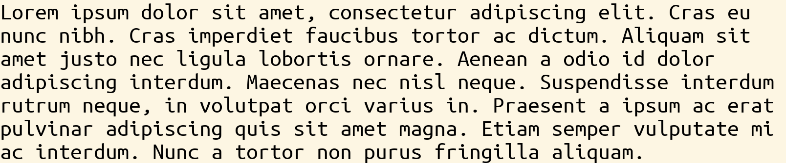

# Text Domain

> **Kind:** reference · **Status:** current · **Stands on:** [system-anatomy.md](../../design/system-anatomy.md)



The text domain bridges structural (syntax tree) and visual (graphics) domains. Text is stored as a flat sequence of spans, each with its own reactive style and color. Selection is a flat character offset.

**Indexing conventions**: paths use `[i]` for the i-th item (1-based) and `{k}` for the cursor at boundary `k` (0-based). The two are readings of the same axis — see [the boundary axis](../kernel/reference.md#the-boundary-axis). In Text the axis appears as spans *and* as characters within a span; the same `[i]` / `{k}` syntax addresses both.

## Types

- **TextBlock**: Container holding a flat sequence of spans (`elements::CollectionDocument`); the top-level text document
- **TextString**: A text span with content and styling
- **TextNewline**: Line break with styling
- **TextSpacing**: Horizontal or vertical spacing
- **TextGraphics**: Embedded graphics within text
- **TextLine**: One line of a block — spans that contain no break and imply one *before* themselves
  (a separator: `n` lines, `n-1` breaks, no phantom trailing blank line). Its `indentation` is a
  property of the line, not a whitespace span, so no caret can land inside it.

  A span inside a line is addressed by an **index path** — `[i]` for a top-level span,
  `[i, j]` for span `j` of line `i` — and the caret path gains one `elements` hop
  (`.elements[i].elements[j].content{k}`). Cursor and word motion cross line boundaries; typing
  edits the line's own span.

  **Not laid out by `TextToGraphics` yet.** `TextToString` and the console backend render lines;
  the graphics pipeline addresses spans by a flat `Int` element index (`SegCoord.span_idx`) and
  silently skips elements it does not recognize, so a line-structured block renders blank there.
  Nothing emits a `TextLine` yet, so nothing hits this.
- **TextNothing** / **TextInsertion**: the domain's insertion kit, generated by `@domain Text`
  (see [macros](../kernel/macros.md#domain)) — the empty-text placeholder, and the
  typed-name buffer Insert opens on it. `"text"` names the domain at any insertion; inside it,
  `"block"` (prefix-free) commits a `TextBlock` carrying one empty span with the caret in it.

  Only `TextBlock` is a completion candidate: the span types each have a required field, so none is
  zero-arg constructible, and none has an `@insertion` factory. A factory would also make a lone
  span committable as a *root* document, which the text pipeline cannot print. Inserting a span
  (an image, a spacing) belongs with a caret-level "insert a span here" gesture, which does not
  exist yet.

## Examples

```julia
# Create a simple text span (default font and color)
span = TextString("Hello")

# Create a span with explicit font and color
span = TextString("Hello", font_ubuntu_monospace_regular_24, color_default)

# Create a span with a computed content thunk
span = TextString(() -> uppercase(doc.name), font_ubuntu_monospace_regular_24, color_default)

# Create a newline
newline = TextNewline(font=font_ubuntu_monospace_regular_24)

# Create a container of spans
text = TextBlock(TextString("Hello"), TextString(" world"))

# Access and modify (transparent via @document macro — no [] needed)
span.content = "New content"
span.font_color = color_default
```

## Selection

Selection is a flat offset across all spans. At the top level, `[i]` selects the i-th span and `{k}` is the cursor between spans. When the path descends into a span, the sub-path indexes characters: `.content[i]` for the i-th character, `.content{k}` for the cursor between characters.

## Styling Fields

Each span has:
- `content::Cell` — the text string
- `font::Cell` — font style (e.g., "bold", "italic", "monospace")
- `font_color::Cell` — text color (name, hex, or rgb)
- `fill_color::Cell` — background fill color
- `line_color::Cell` — border/line color
- `padding::Cell` — inset/padding value

## Key Features

- Each span is independently styled
- Reactive styling updates propagate automatically
- Flat character offset selection for easy navigation

## Gesture mapping (`read_gesture`)

The geometry-free half of the Text reader lives on the document itself:
`read_gesture(::TextBlock, gesture)` ([text/Text.jl](../../../source/text/Text.jl))
maps an input gesture to an operation expressed against the `TextBlock`'s own
references (reading only `elements` and `selection`, never any pixel layout):

- `KeyPress(c)` → `ReplaceStringRangeOperation` (character insert)
- `Backspace` / `Delete` → `ReplaceStringRangeOperation`
- `Left` / `Right` → cross-span character cursor movement
- `Ctrl+Home` / `Ctrl+End` → jump to the first/last span character
- `Ctrl+.` → `ToggleCollapseOperation` (recognised here, resolved at the syntax layer)
- the decline rules (Alt+arrows, plain arrows while structural, Tab) return
  `nothing` so an outer (syntax) layer can own the gesture

`TextToGraphics` delegates to this and adds only the geometry-dependent arms
(visual up/down, plain Home/End, mouse click). Any backend that renders a
`TextBlock` directly — e.g. the `ConsoleBackend` — therefore gets character-level
editing without a graphics layout pass. See
[projection-system.md](../kernel/projection-system.md) for the full reader split.
