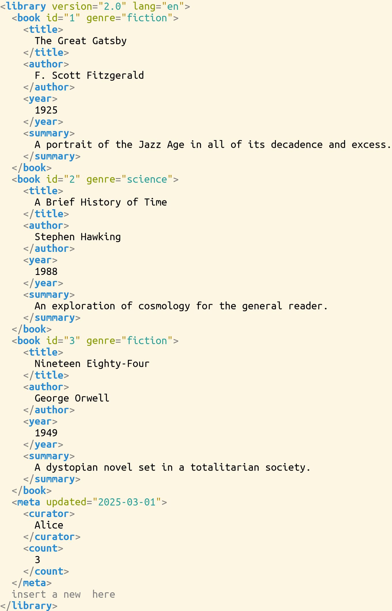

# XML Domain

> **Kind:** reference · **Status:** current · **Stands on:** [system-anatomy.md](../../design/system-anatomy.md), [domain-inventory.md](../../design/domain-inventory.md)



The XML domain represents XML documents as a tree of reactive nodes. Every node is a Document with reactive Cell fields. Attributes are first-class documents so the selection mechanism can descend into attribute values.

**Indexing conventions**: paths use `[i]` for the i-th item (1-based) and `{k}` for the cursor at boundary `k` (0-based). The two are readings of the same axis — see [the boundary axis](../kernel/reference.md#the-boundary-axis). In XML the axis appears as child nodes, attributes, *and* characters in text content or attribute values; the same `[i]` / `{k}` syntax addresses both.

## Types

- **XmlAttribute**: Holds a name and value pair
- **XmlText**: Text content within elements
- **XmlElement**: Container with tag, attributes, and child nodes

## Examples

```julia
# Create a text node
text = XmlText("Hello world")

# Create an attribute
attr = XmlAttribute("id", "123")

# Create an element with attributes
elem = XmlElement("div", [XmlAttribute("class", "container")])

# Create an element with children
elem = XmlElement("p", [XmlText("Paragraph text")])

# Create a complete element
elem = XmlElement("div", 
    [XmlAttribute("class", "container")],
    [XmlText("Content")]
)

# Access and modify (transparent via @document macro — no [] needed)
text.content = "New text"
attr.value = "456"
push!(elem, XmlText("More content"))
```

## Selection

Selection paths can descend into (`[i]` = 1-based item, `{k}` = 0-based cursor):
- Attribute access: `.attrs[i]` for the i-th attribute, `.attrs{k}` for the cursor between attributes
- Attribute value: `.attrs[i].value[i]` for the i-th character, `.attrs[i].value{k}` for the cursor between characters
- Child nodes: `.children[i]` for the i-th child, `.children{k}` for the cursor between children
- Text content: `.content[i]` for the i-th character, `.content{k}` for the cursor between characters

## Key Features

- Attributes are first-class documents, not just strings
- Full selection support for attribute values
- Reactive updates through Cell system
