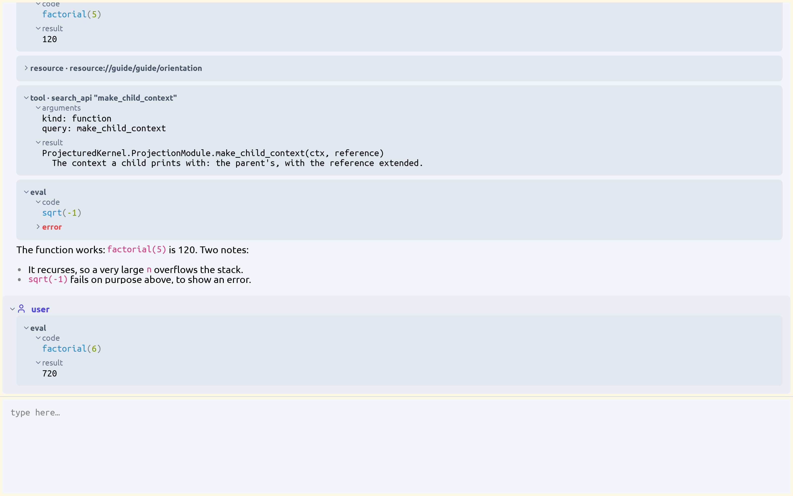
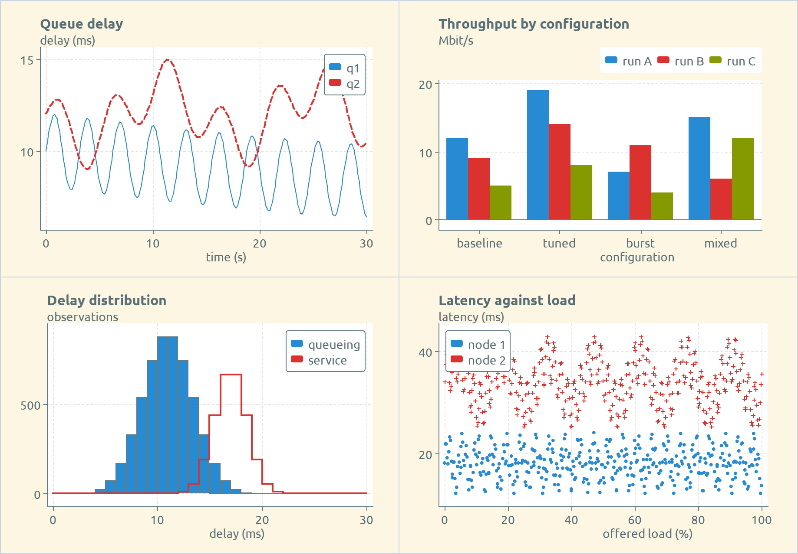
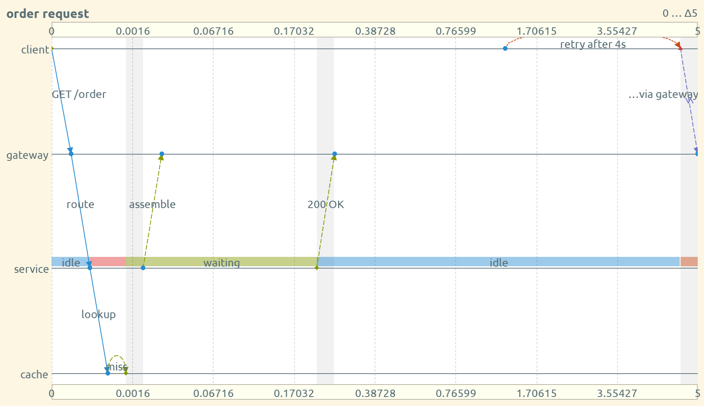
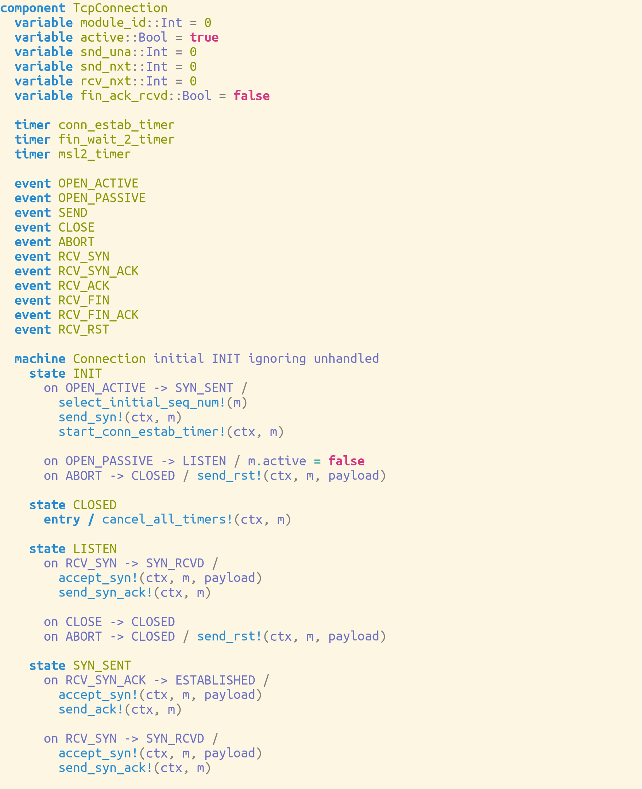
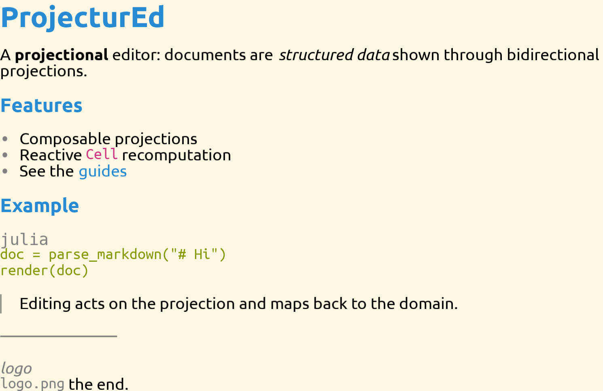
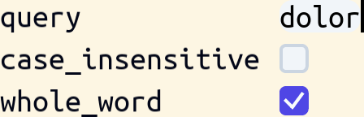
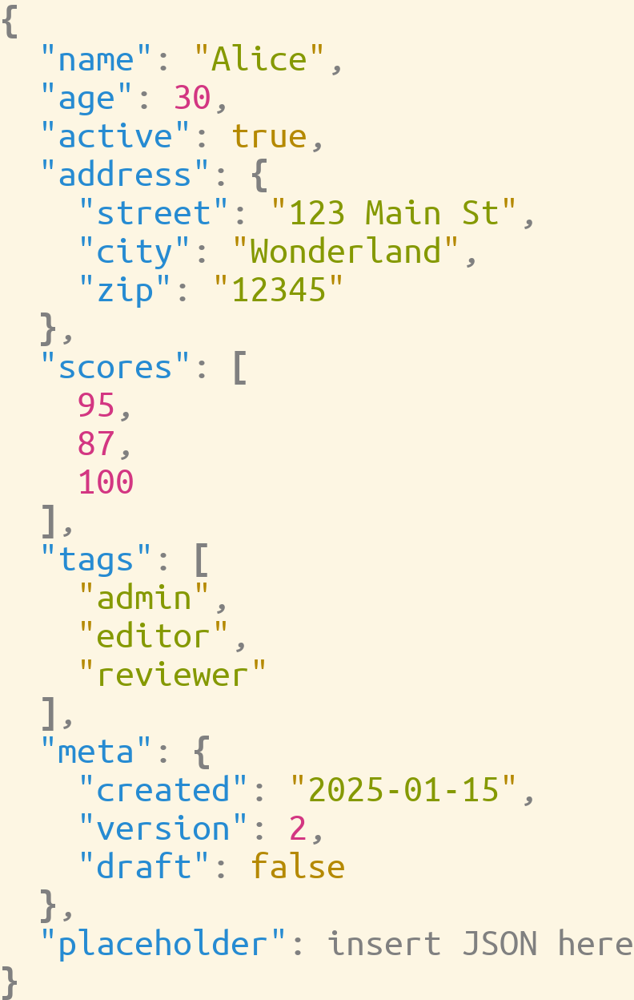
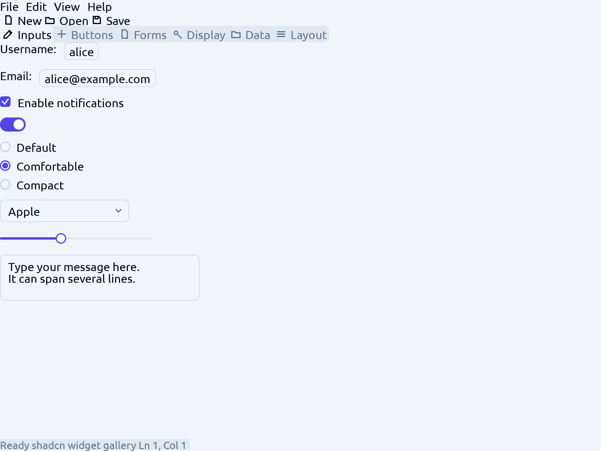
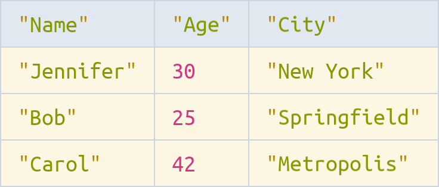

<!-- _class: lead -->

# ProjecturEd

One structure, many editable views — with an AI assistant.

An application to view and edit structured data,
and a generic user interface for any Julia program.

<br>

<span class="muted">github.com/projectured/projectured-julia</span>

---

## What it is

- A **viewer**: it shows data as a tree, a statement with syntax colours, a chart, a diagram, a form or a table.
- An **editor**: most views take your edits, and an edit changes the data itself.
- An **AI assistant**: a language model inside the program, with the same data and the same edits as you.

A view is normally designed, the way you design a window of an application. For data with no designed view, ProjecturEd makes one on demand, from the structure of the value itself.

---

## Structured data, one window

- Works with about twenty kinds of data: JSON, YAML, XML, Markdown, reStructuredText, SQL, Julia code, math formulas, charts, graphs, and state machines.
- Opens them in one window, in tabs and split panes.
- One document can mix kinds: JSON inside XML inside prose.
- Written in Julia — so it is also a generic user interface for your own Julia programs.

---

## What you can do with it

<div class="cols">
<div>

- **View and edit structured files as structures** — JSON, YAML, XML, Markdown, SQL, Julia, and a math notation.
- **Design a tool window without a GUI toolkit** — widgets, tables, cards, tabs, split panes.
- **Look into a running program** — a reflection view shows any object as a tree.
- **Show results** — line, bar, histogram, scatter and strip charts, and sequence charts.

</div>
<div>

- **Model behaviour and run it** — a state machine produces runnable Julia code.
- **Ask for a change in plain words** — the assistant searches the API, writes Julia, and runs it.
- **Drive the editor from outside** — an MCP client gets the same tools as the assistant.
- **Put a view somewhere else** — a native window, a browser, a terminal, a PDF, or a video.

</div>
</div>

---

<!-- _class: lead -->

## Screenshots

The same editor, open on different kinds of data.

---

<!-- _class: lead -->

## The assistant panel



<span class="muted">The assistant panel beside an open document; the conversation is a document with its own view.</span>

---

<!-- _class: lead -->

## A chart



<span class="muted">A line chart as a document; a data point is a part of the structure, and it is selectable.</span>

---

<!-- _class: lead -->

## A sequence chart



<span class="muted">Participants, occurrences and the arrows between them, as one document.</span>

---

<!-- _class: lead -->

## A state machine



<span class="muted">States, guarded transitions and timers; the machine produces runnable Julia code.</span>

---

<!-- _class: lead -->

## Markdown



<span class="muted">A Markdown file, open and edited as a structure, not as a block of text.</span>

---

<!-- _class: lead -->

## A view on demand



<span class="muted">A Julia value with no designed view, shown as a form of its fields by reflection.</span>

---

<!-- _class: lead -->

## JSON



<span class="muted">A JSON file, open and navigated as an object tree, not as text.</span>

---

<!-- _class: lead -->

## Widgets



<span class="muted">Labels, a checkbox, a text box and a button: the widgets a tool window is made from.</span>

---

<!-- _class: lead -->

## A table



<span class="muted">A table view; each cell keeps the view of its own kind of data.</span>

---

<!-- _class: lead -->

## How it works

ProjecturEd is a projectional editor. The data is the source, and every view is computed from it.

---

## The five ideas

| Idea | What it is |
| --- | --- |
| Document | The data: a tree of typed structures, each field a reactive cell. |
| Projection | A printer that makes the view, and a reader that maps an edit in the view back to an operation. |
| Selection | Where you are: a path into the data, not a caret in a text. |
| Operation | A change of the data, from a key press or from the assistant. |
| Tool set | What the assistant and an MCP client can call. |

---

## Cells

- Each field of a document is a reactive cell.
- A read of a cell records that the reader depends on it.
- A write marks every dependent value invalid; only what is read again gets recomputed.
- After a change, ProjecturEd recomputes only the parts of the views that depend on the change and are on the screen.

---

## The tool set

What the assistant and an MCP client can call:

- Search the API of the loaded packages.
- Read a guide.
- Run Julia code against the live editor.
- Change the data.

---

<!-- _class: lead -->

## The loop

A key press goes through the projections to the data.
The change comes back through the same projections to the screen.

---

## The assistant

- Runs inside the application, with a local model through Ollama, or with Claude.
- Searches the API of the loaded packages, writes Julia code, and runs it in the application.
- Changes the data with the same operations as a key press.

---

## The conversation is a document

- The conversation has its own view, like any other document.
- A message and an executed code block are structured data, so they can be selected and edited.
- You can run Julia code in it yourself, the same way the assistant does.

---

## MCP

- An external client, for example Claude Code, reaches the same tools through MCP.
- `bin/projectured --mcp a.json` starts a server; a client connects at `http://127.0.0.1:9876/mcp`.
- The tool set is a layer of the kernel. The assistant and an MCP client use it.

---

## Extend it with your own domain

- Add a domain: its document types, the projections that make its views, its operations and its key bindings.
- A domain is a package of its own, and no other domain depends on it.
- You can work on your domain without changes to other domains, while other developers work on theirs.

---

## What a new domain gets for free

- Selection and navigation, search, copy and paste.
- Filtered and sorted views, with no extra code in the domain.
- A text notation and a file format, saving, and every backend.
- The AI assistant, which can find and call your functions.

---

## Status

<span class="tag">under development</span>

ProjecturEd is under development. Most features work, but it is not a finished product. Some parts are incomplete, and names and interfaces can still change.

---

## Limits, today

- Undo and redo work in the application; a window of your own has no history until you put one there.
- Type-in of single characters does not work the same way in every domain.
- The assistant needs a local Ollama server with a pulled model, or an Anthropic API key.
- SDL2 and SDL_ttf must be installed for a native window.
- The packages are not in the General registry: clone the repository and use `environment/all`.

---

## Where to start

Needs Julia 1.11 or later, and SDL2 with SDL_ttf for a native window.

```sh
git clone https://github.com/projectured/projectured-julia
cd projectured-julia
bin/projectured
```

Opens a window with a Files pane, open files in tabs, and the assistant.

---

## Options

```sh
bin/projectured --help                       # every option
bin/projectured --root=~/project a.json      # the Files pane lists another directory
bin/projectured --assistant=none notes.txt   # no assistant
bin/projectured --backend=web a.json         # in a browser
bin/projectured --mcp a.json                 # with an MCP server
```

---

## Read next

- [setup-guide.md](../guide/setup-guide.md) and [examples-tour.md](../guide/examples-tour.md) — to use it.
- [concepts.md](../design/concepts.md) and [view-your-data-guide.md](../guide/view-your-data-guide.md) — to show your own data.
- [engineer-tour.md](../design/engineer-tour.md), [system-anatomy.md](../design/system-anatomy.md) and [CONTRIBUTING.md](../../CONTRIBUTING.md) — to work on ProjecturEd.

---

<!-- _class: lead -->

# Thank you

<span class="muted">Mozilla Public License 2.0.</span>

<span class="muted">github.com/projectured/projectured-julia</span>
