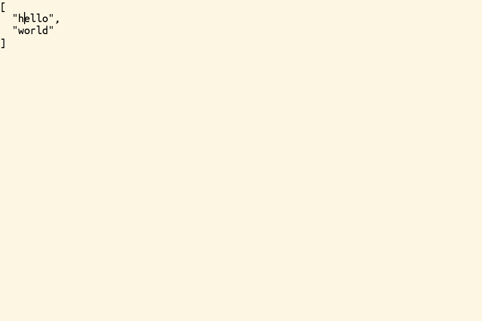

# Syntax Domain



The syntax domain provides a generic intermediate representation between semantic domains (JSON, XML) and text. It represents structured data as a tree of nodes with delimiters.

**Indexing conventions**: paths use `[i]` for the i-th item (1-based) and `{k}` for the cursor at boundary `k` (0-based). The two are readings of the same axis — see [the boundary axis](../editor/reference.md#the-boundary-axis). In Syntax the axis appears as child nodes *and* as characters within delimiters or leaf values; the same `[i]` / `{k}` syntax addresses both.

## Types

- **SyntaxLeaf**: Represents a primitive value with open, value, and close delimiters
- **SyntaxNode**: Represents a compound structure with children and delimiters

## Examples

```julia
# Create a syntax leaf (e.g., for a JSON string)
leaf = SyntaxLeaf(
    TextString("\""),           # open delimiter
    TextString("hello"),        # value
    TextString("\"")            # close delimiter
)

# Create a syntax node (e.g., for a JSON array)
node = SyntaxNode(
    TextString("["),           # open delimiter
    TextString("]"),           # close delimiter
    TextString(", "),          # separator
    [Cell(child1), Cell(child2)], # children
    true                         # indent
)
```

## Selection

Selection paths can reference:
- Delimiters: `.open[i]` / `.open{k}`, `.close[i]` / `.close{k}`, `.sep[i]` / `.sep{k}` — i-th character or cursor between characters
- Children: `.children[i]` for the i-th child, `.children{k}` for the cursor between children
- Leaf values: `.value[i]` for the i-th character, `.value{k}` for the cursor between characters

## TextString

Each delimiter or value is a `TextString` containing:
- Text content
- Font style
- Font color
- Background fill

## Collapsed and indentation fields

Both `SyntaxLeaf` and `SyntaxNode` carry:

- `indentation::Int` — the nesting depth used for pretty-printing (set by the upstream projection; consumers typically leave this at `0`)
- `collapsed::Bool` — when `true`, the node is rendered on a single line; children or value are not expanded

```julia
node.collapsed = true    # collapse this node to one line
node.indentation = 2     # override indentation depth
```

## Key Features

- Generic representation for multiple domains
- Delimiters are first-class for cursor positioning
- Supports indentation for pretty-printing
- Selection mechanism works on delimiters and content
