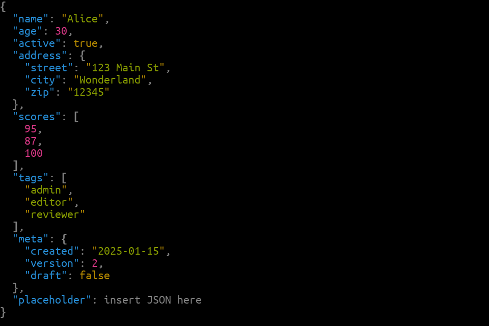

# Plan: Automated screenshot generation and guide injection

## Context

Four of 27 examples already have screenshots in `image/` (json, widget, table, julia), generated manually and committed as BMP+PNG pairs. `README.md` shows these four in a 2×2 table; `guide/examples-tour.md` links to the `image/` directory but embeds no images inline. The goal is:
1. A script that generates screenshots for **all 27 examples** automatically.
2. A second script (or the same script) that injects image references into the affected guide files idempotently.

---

## Constraints and key facts

- `write_image_example(name, path; width, height)` generates **BMP only** (SDL2 limitation in `program/src/backend/Sdl.jl:636–643`). PNG conversion requires a second step.
- Existing images are 960×640 pixels — the new screenshots should match.
- Naming pattern in `image/`: `{example-name}-example.bmp` / `{example-name}-example.png` (hyphens, not underscores, e.g. `json_sorted` → `json-sorted-example.png`).
- The 27 examples are defined in `example/src/Examples.jl:11–49` as `const examples = [...]`.
- Scripts run with `julia --project=.` from the repo root (picks up `Projectured` and `ProjecturedExample`).

---

## Step 1 — Screenshot generation script: `tools/generate_screenshots.jl`

**New file.** Runs standalone with `julia --project=. tools/generate_screenshots.jl`.

Logic:
```julia
using Projectured, ProjecturedExample

const WIDTH  = 960
const HEIGHT = 640
const IMAGE_DIR = joinpath(@__DIR__, "..", "image")

for ex in examples
    safe_name = replace(ex.name, "_" => "-")
    bmp = joinpath(IMAGE_DIR, "$safe_name-example.bmp")
    png = joinpath(IMAGE_DIR, "$safe_name-example.png")

    @info "Generating $(ex.name)..."
    try
        write_image_example(ex, bmp; width=WIDTH, height=HEIGHT)
        run(`convert $bmp $png`)   # ImageMagick
        @info "  ✓ $png"
    catch e
        @warn "  ✗ $(ex.name): $e"
    end
end
```

Key design choices:
- Underscore → hyphen in filename (matches existing convention: `julia_example` → `julia-example.png`).
- `try/catch` per example so one failure doesn't abort the whole batch.
- ImageMagick `convert` is the PNG conversion tool. The file-level docstring will say to `apt install imagemagick` if missing.
- BMP originals are **kept** alongside PNGs (matches existing practice).
- `width=960, height=640` matches existing four screenshots.

---

## Step 2 — Guide injection script: `tools/inject_screenshots.jl`

**New file.** Runs standalone with `julia --project=. tools/inject_screenshots.jl`. Idempotent — running it again produces no diff.

### 2a — `guide/examples-tour.md`

The file has six `##` sections, each with a header like:
```
## 1. JSON (`run_example("json")`)
```

After each such header (and the blank line following it), insert the screenshot if not already present:
```markdown

```

Pattern to match: `r"^## \d+\. \w+ \(`run_example\(\"(\w+)\"\)`\)"` → captures example name. Skip insertion if the very next non-blank line is already ``.

Also update the preamble (line 5) from the link-only reference to a proper description now that images are embedded inline.

### 2b — `guide/document/*.md` domain guides

Eight files: json.md, xml.md, text.md, syntax.md, graphics.md, widget.md, workbench.md, collection.md.

Map each filename to the corresponding example name (e.g. `json.md` → `json`, `workbench.md` → `workbench`). Insert a screenshot block at the top of the file, **after the first `#` heading and its introductory paragraph**, if not already present:

```markdown

```

Detection: if any ` |  |  |

| Syntax tree | Julia AST | Workbench |
|---|---|---|
|  |  |  |
```

---

## Step 3 — Makefile

Add `Makefile` at repo root with two targets:

```makefile
.PHONY: screenshots inject-screenshots

screenshots:
	julia --project=. tools/generate_screenshots.jl

inject-screenshots: screenshots
	julia --project=. tools/inject_screenshots.jl
```

---

## Step 4 — Document in `guide/debugging.md`

Add a section "## Generating all screenshots" that documents:
- `make screenshots` or `julia --project=. tools/generate_screenshots.jl`
- Requires ImageMagick (`apt install imagemagick`)
- Output goes to `image/`

---

## Files created / modified

| File | Action |
|---|---|
| `tools/generate_screenshots.jl` | **New** — batch BMP+PNG generation for all 27 examples |
| `tools/inject_screenshots.jl` | **New** — idempotent guide injection script |
| `Makefile` | **New** — `screenshots` and `inject-screenshots` targets |
| `guide/examples-tour.md` | Modified — inline `![...]` after each of 6 `##` headings |
| `guide/document/json.md` | Modified — add screenshot near top |
| `guide/document/xml.md` | Modified — add screenshot near top |
| `guide/document/text.md` | Modified — add screenshot near top |
| `guide/document/syntax.md` | Modified — add screenshot near top |
| `guide/document/graphics.md` | Modified — add screenshot near top |
| `guide/document/widget.md` | Modified — add screenshot near top |
| `guide/document/workbench.md` | Modified — add screenshot near top |
| `guide/document/collection.md` | Modified — add screenshot near top |
| `README.md` | Modified — expand screenshot table from 4 to 6 examples |
| `guide/debugging.md` | Modified — add "Generating all screenshots" section |

---

## Verification

```bash
# 1. Generate all screenshots (requires Julia + ImageMagick)
julia --project=. tools/generate_screenshots.jl

# 2. Confirm images exist
ls -1 image/*-example.png | wc -l   # should be 27

# 3. Run guide injection
julia --project=. tools/inject_screenshots.jl

# 4. Verify idempotency
julia --project=. tools/inject_screenshots.jl   # second run produces no changes

# 5. Inspect guide changes
git diff guide/ README.md

# 6. Spot-check that image paths resolve
# Open guide/examples-tour.md in a markdown previewer
```
